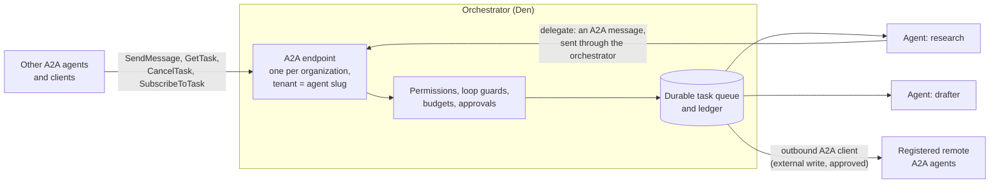
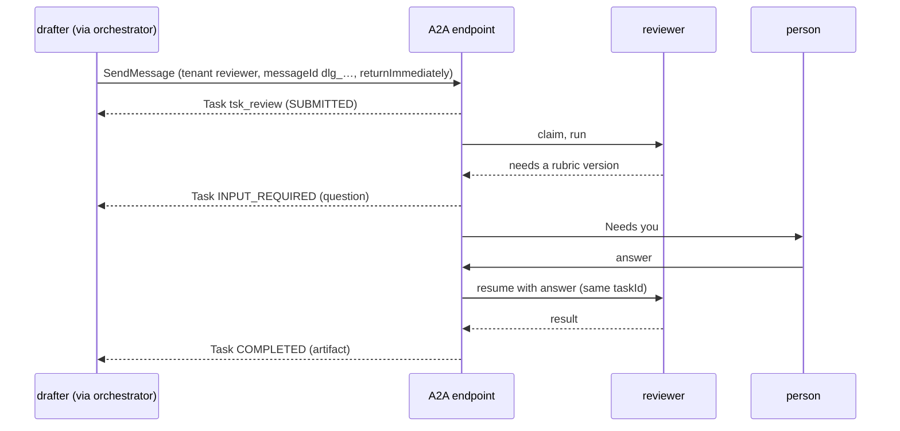

# Agent-to-agent with A2A

Status: proposal. Part of [the orchestrator plan](README.md). Covers brief steps 3
(registration and discovery) and 6 (communication), and the product idea behind
the tab: agents that run constantly, are created with their own instructions, are
listed in one place, and talk to each other over the open
[A2A (Agent2Agent) protocol](https://github.com/a2aproject/A2A).

## The idea in one paragraph

The orchestrator is the place agents live. A2A is the language they speak at their
edges. Every agent has an **Agent Card**: its entry in the list, generated from its
configuration. When one agent hands work to another, that is an A2A message. The
orchestrator is the A2A server for every agent it runs, and acts as the A2A client
when an agent delegates. Because each message becomes a durable task, everything
else in this plan (restart safety, deduplication, approvals, budgets, the ledger)
applies to every exchange between agents, not just the ones inside one process.

MCP and A2A do different jobs and both stay. **MCP** is how an agent reaches tools
and connected services (the existing OpenWork MCP gateway). **A2A** is how an agent
reaches another agent.

## What A2A v1.0 says

Read from the protocol's own repository (the specification document in its `docs`
folder, and `specification/a2a.proto`), because the project website is not reachable from the
environment this plan was written in. The extraction was done by an automated
fetch, so check the primary text before relying on any single sentence.

| Topic | What the specification says |
| --- | --- |
| Version | `1.0.0` was the latest release when read. Patch versions do not affect compatibility. Clients send an `A2A-Version: Major.Minor` header |
| Bindings | JSON-RPC 2.0, gRPC and HTTP+JSON, plus custom bindings named by URI. A client takes the first binding it supports from the card's `supportedInterfaces` list, in the agent's preference order |
| Operations | `SendMessage`, `SendStreamingMessage`, `GetTask`, `ListTasks`, `CancelTask`, `SubscribeToTask`, four push-notification-config operations, `GetExtendedAgentCard` |
| Task states | `SUBMITTED`, `WORKING`, `INPUT_REQUIRED`, `AUTH_REQUIRED`, and the finished states `COMPLETED`, `FAILED`, `CANCELED`, `REJECTED`. A message sent to a finished task cannot be accepted |
| Data | A `Task` has `id`, `contextId`, `status`, `artifacts`, `history`. A `Message` has `messageId`, `role` (`ROLE_USER` or `ROLE_AGENT`), `parts`, `contextId`, `taskId`, `referenceTaskIds`. A `Part` is exactly one of `text`, `raw` (bytes), `url` or `data` (any JSON), with `mediaType`, `filename`, `metadata`. An `Artifact` is a task's output |
| IDs | Task ids are generated by the server; a client cannot choose one. `contextId` groups tasks and messages in one conversation. A follow-up to a paused task reuses its `taskId` and `contextId` |
| Idempotency | `SendMessage` "MAY be idempotent"; agents "may utilize the `messageId` to detect duplicate messages" |
| Agent Card | Served at `/.well-known/agent-card.json`. Fields: `name`, `description`, `version`, `supportedInterfaces` (`url`, `protocolBinding`, `protocolVersion`, `tenant`), `capabilities` (`streaming`, `pushNotifications`, `extendedAgentCard`, `extensions`), `skills`, `defaultInputModes`, `defaultOutputModes`, `securitySchemes`, `securityRequirements`, `signatures`, `provider`, `documentationUrl`, `iconUrl` |
| Skills | `id`, `name`, `description`, `tags`, `examples`, `inputModes`, `outputModes` |
| Security | Five scheme types (API key, HTTP auth, OAuth 2.0, OpenID Connect, mutual TLS). Servers MUST authenticate every request, MUST return an authorization error when permissions are missing, and MUST NOT reveal resources the caller may not see. Production MUST use TLS. Cards MAY be signed (JWS with JCS canonicalisation) and clients SHOULD verify a signature before trusting a card |
| Pausing | `INPUT_REQUIRED` and `AUTH_REQUIRED` are not final. `AUTH_REQUIRED` may be fulfilled by contacting a human, and a decision obtained there must not be assumed to authorise later messages |
| Extensions | Declared in `capabilities.extensions` (`uri`, `description`, `required`) and activated per request with an `A2A-Extensions` header. Extension data rides in `metadata` keyed by the extension URI |
| Gaps | The specification does not address push-notification webhook validation, request forgery or replay in any detail. `tenant` is a routing field, with no isolation semantics defined |

## What A2A does not give us

| Need | Where it comes from |
| --- | --- |
| A durable queue, retries, dead letters | [architecture.md](architecture.md). A2A describes a task's lifecycle, not how a server keeps it alive across restarts |
| Agents that wake on a schedule or run constantly | Run modes in architecture.md. A2A is request-driven; a continuous agent is a producer that sends A2A messages, not a server waiting for them |
| Approvals before risky actions | [governance.md](governance.md). A2A offers the pause states; it does not decide who may resume them |
| Loop, cost and fan-out limits | governance.md |
| Memory, audit, permissions | memory.md, the ledger, the permission matrix |

## How it fits



Rules that follow from the specification and from this plan:

1. **Agents never connect to each other.** Agent A's delegation to agent B is an A2A
   `SendMessage` that the orchestrator receives, checks and stores as a task before B
   ever sees it. B's reply is a status update and artifacts on that task.
2. **One A2A endpoint per organization.** Agents are addressed by `tenant`, which is
   the agent's slug. `tenant` is a routing key only; the specification defines no
   isolation for it, so every request is authorised against the caller's identity,
   the organization and the agent's own permissions.
3. **Cards are generated, never hand-written.** The Agent Card comes from the active
   configuration version (below), so what the list shows is what runs.
4. **Skills map to task types.** A skill on a card is a request the agent accepts;
   each one names the task type that a request for it becomes.
5. **Delegation is a message with a lineage.** Hop count, path and taint travel in
   the `process` extension and are enforced by the orchestrator, not trusted from the
   sender.
6. **Finished means finished.** A2A does not let a finished task be reopened, so a
   re-queue creates a new task that references the old one.
7. **Everything from outside is untrusted.** A message or card from another party
   taints the task it creates and is never merged into an agent's instructions.

## Agent Card from configuration

The configuration's `a2a` block holds only what cannot be derived: how far the agent
is reachable (`exposure`) and the requests it handles (`skills`). Everything else on
the card comes from fields the agent already has.

| Card field | Comes from |
| --- | --- |
| `name` | `identity.displayName` |
| `description` | `identity.description`, or the agent's responsibilities joined, for agents only the orchestrator talks to. Required before an agent is reachable beyond the orchestrator |
| `version` | The saved version number of the active configuration |
| `supportedInterfaces` | The organization's A2A base URL, binding `HTTP+JSON`, protocol `1.0`, and `tenant` set to the agent's slug |
| `capabilities` | Streaming off until `SubscribeToTask` ships; push notifications off; three optional OpenWork extensions (below) |
| `skills` | `a2a.skills`, each pointing at a task type in `role.accepts` |
| `securitySchemes`, `securityRequirements` | Den's authentication configuration (empty only for `internal` agents) |
| `signatures` | A JWS over the canonicalised card, once signing keys exist |

**Exposure.** `internal`, the default and the only value in the pilot, means only
agents the orchestrator runs can send to this one, and its card is served only inside
the organization. `organization` adds authenticated principals of the organization
and requires a description and at least one skill. Reaching beyond the organization
is a later step.

**Why the card is the registry.** The brief asks for agent registration and
discovery. The registry is the set of cards for an organization's active agents: it
lists who exists, what each can be asked, and how to reach it, and it is what the
Orchestrator tab shows.

**A naming trap.** In OpenWork, "skills" already means installable instruction packs
in the Library. In the product, A2A skills are called **Requests it handles**, and
Library skills stay "Skills". The code and the configuration keep the A2A word
because that is what the protocol calls them.

Generated for the research agent (version 3):

```json
{
  "name": "Research",
  "description": "Gather the facts needed to answer one request",
  "version": "3",
  "supportedInterfaces": [
    {
      "url": "https://den.example.com/a2a",
      "protocolBinding": "HTTP+JSON",
      "protocolVersion": "1.0",
      "tenant": "research"
    }
  ],
  "capabilities": {
    "streaming": false,
    "pushNotifications": false,
    "extendedAgentCard": false,
    "extensions": [
      {
        "uri": "https://openwork.example/a2a/extensions/process/v1",
        "description": "Skill selection, hop count and taint on messages and tasks",
        "required": false
      },
      {
        "uri": "https://openwork.example/a2a/extensions/approval/v1",
        "description": "Approval details when a task waits for a person",
        "required": false
      },
      {
        "uri": "https://openwork.example/a2a/extensions/budget/v1",
        "description": "Cost reserved and spent by a task",
        "required": false
      }
    ]
  },
  "securitySchemes": {},
  "securityRequirements": [],
  "defaultInputModes": [
    "text/plain",
    "application/json"
  ],
  "defaultOutputModes": [
    "text/plain",
    "application/json"
  ],
  "skills": [
    {
      "id": "research-request",
      "name": "Research a request",
      "description": "Gathers the facts needed to answer one inbound request and returns cited findings.",
      "tags": [
        "research",
        "support"
      ],
      "examples": [
        "Find what we know about request r1 and cite the playbook entries you used"
      ],
      "inputModes": [
        "text/plain",
        "application/json"
      ],
      "outputModes": [
        "text/plain",
        "application/json"
      ]
    }
  ]
}
```

### The code

The A2A subset in the protocol's own JSON naming, the internal-to-A2A state
projection, and the card generator. It compiles under `strict` TypeScript with Zod 4.
The projection is an exhaustive `switch`, so adding an internal task state fails to
compile until its A2A state is chosen. Inbound cards are read leniently (unknown
fields ignored), and cards we emit are checked to contain only fields the
specification defines.

```ts
import { z } from "zod"
import type { AgentConfigV1 } from "./agent-config"
import type { TaskState } from "./states"

/**
 * A subset of the A2A v1.0 data model, in the protocol's JSON naming (camelCase fields,
 * enum values spelled as in the specification). Source: specification/a2a.proto in the
 * a2aproject/A2A repository. Validate against the official schema and an official SDK in M1.
 */

const jsonObjectSchema = z.record(z.string(), z.json())

// --- tasks and messages ------------------------------------------------------

export const a2aTaskStateSchema = z.enum([
  "TASK_STATE_SUBMITTED",
  "TASK_STATE_WORKING",
  "TASK_STATE_INPUT_REQUIRED",
  "TASK_STATE_AUTH_REQUIRED",
  "TASK_STATE_COMPLETED",
  "TASK_STATE_FAILED",
  "TASK_STATE_CANCELED",
  "TASK_STATE_REJECTED",
])
export type A2aTaskState = z.infer<typeof a2aTaskStateSchema>

/** Messages sent to a task in one of these states are refused. A finished task is never reopened. */
export const a2aTerminalStates: readonly A2aTaskState[] = [
  "TASK_STATE_COMPLETED", "TASK_STATE_FAILED", "TASK_STATE_CANCELED", "TASK_STATE_REJECTED",
]

export const a2aRoleSchema = z.enum(["ROLE_USER", "ROLE_AGENT"])

const partFields = {
  metadata: jsonObjectSchema.optional(),
  filename: z.string().max(255).optional(),
  mediaType: z.string().max(127).optional(),
}

/** Exactly one of text, raw (base64 bytes), url or data (any JSON). */
export const a2aPartSchema = z.union([
  z.strictObject({ text: z.string(), ...partFields }),
  z.strictObject({ raw: z.base64(), ...partFields }),
  z.strictObject({ url: z.url(), ...partFields }),
  z.strictObject({ data: z.json(), ...partFields }),
])

export const a2aMessageSchema = z.strictObject({
  messageId: z.string().min(1).max(200),
  contextId: z.string().min(1).max(200).optional(),
  taskId: z.string().min(1).max(200).optional(),
  role: a2aRoleSchema,
  parts: z.array(a2aPartSchema).min(1),
  metadata: jsonObjectSchema.optional(),
  extensions: z.array(z.string()).optional(),
  referenceTaskIds: z.array(z.string()).optional(),
})

export const a2aTaskStatusSchema = z.strictObject({
  state: a2aTaskStateSchema,
  message: a2aMessageSchema.optional(),
  timestamp: z.iso.datetime().optional(),
})

export const a2aArtifactSchema = z.strictObject({
  artifactId: z.string().min(1).max(200),
  name: z.string().max(200).optional(),
  description: z.string().max(1_000).optional(),
  parts: z.array(a2aPartSchema).min(1),
  metadata: jsonObjectSchema.optional(),
  extensions: z.array(z.string()).optional(),
})

export const a2aTaskSchema = z.strictObject({
  id: z.string().min(1).max(200),
  contextId: z.string().min(1).max(200).optional(),
  status: a2aTaskStatusSchema,
  artifacts: z.array(a2aArtifactSchema).optional(),
  history: z.array(a2aMessageSchema).optional(),
  metadata: jsonObjectSchema.optional(),
})

export const a2aSendMessageRequestSchema = z.strictObject({
  tenant: z.string().optional(),
  message: a2aMessageSchema,
  configuration: z.strictObject({
    acceptedOutputModes: z.array(z.string()).optional(),
    historyLength: z.number().int().nonnegative().optional(),
    returnImmediately: z.boolean().optional(),
  }).optional(),
  metadata: jsonObjectSchema.optional(),
})

/** A send returns either a task (asynchronous work) or a direct message. */
export const a2aSendMessageResponseSchema = z.union([
  z.strictObject({ task: a2aTaskSchema }),
  z.strictObject({ message: a2aMessageSchema }),
])

export const a2aTaskStatusUpdateEventSchema = z.strictObject({
  taskId: z.string().min(1),
  contextId: z.string().min(1),
  status: a2aTaskStatusSchema,
  metadata: jsonObjectSchema.optional(),
})

// --- the Agent Card ----------------------------------------------------------

const agentSkillSchema = z.looseObject({
  id: z.string().min(1),
  name: z.string().min(1),
  description: z.string().min(1),
  tags: z.array(z.string()),
  examples: z.array(z.string()).optional(),
  inputModes: z.array(z.string()).optional(),
  outputModes: z.array(z.string()).optional(),
})

/** Inbound cards from other parties are read tolerantly: unknown fields are ignored, not rejected. */
export const a2aAgentCardSchema = z.looseObject({
  name: z.string().min(1),
  description: z.string().min(1),
  supportedInterfaces: z.array(z.looseObject({
    url: z.url(),
    protocolBinding: z.string().min(1),
    protocolVersion: z.string().min(1),
    tenant: z.string().optional(),
  })).min(1),
  provider: z.looseObject({ organization: z.string(), url: z.url() }).optional(),
  version: z.string().min(1),
  documentationUrl: z.url().optional(),
  capabilities: z.looseObject({
    streaming: z.boolean().optional(),
    pushNotifications: z.boolean().optional(),
    extendedAgentCard: z.boolean().optional(),
    extensions: z.array(z.looseObject({
      uri: z.url(),
      description: z.string().optional(),
      required: z.boolean().optional(),
    })).optional(),
  }),
  securitySchemes: jsonObjectSchema.optional(),
  securityRequirements: z.array(jsonObjectSchema).optional(),
  defaultInputModes: z.array(z.string()),
  defaultOutputModes: z.array(z.string()),
  skills: z.array(agentSkillSchema),
  signatures: z.array(jsonObjectSchema).optional(),
  iconUrl: z.url().optional(),
})
export type A2aAgentCard = z.infer<typeof a2aAgentCardSchema>

/**
 * Extension namespace for what A2A does not carry: approvals, process routing and lineage, and budgets. Illustrative host;
 * the real namespace is an open decision. Every extension is declared `required: false`, so a plain
 * A2A client works without knowing any of them.
 */
export const OPENWORK_EXTENSION_BASE = "https://openwork.example/a2a/extensions"
export const openworkExtensions = {
  approval: `${OPENWORK_EXTENSION_BASE}/approval/v1`,
  process: `${OPENWORK_EXTENSION_BASE}/process/v1`,
  budget: `${OPENWORK_EXTENSION_BASE}/budget/v1`,
} as const satisfies Record<string, string>

// --- internal task state to A2A state ------------------------------------------

/**
 * The state an A2A client sees. Written as an exhaustive switch so that adding an internal
 * state fails to compile until its A2A state is chosen.
 *
 * - A task waiting for a person's approval is AUTH_REQUIRED: the specification lets the client
 *   contact a human to fulfil it, and says a decision obtained there must not be assumed to
 *   authorise later messages, which matches approvals that bind to one action.
 * - A task a policy refused to run (permission, loop guard, budget) is REJECTED.
 * - Dead-lettered and expired tasks are FAILED. A2A has no way to reopen a finished task, so
 *   re-queuing one creates a new task that references the old one (`referenceTaskIds`).
 */
export function a2aStateForTask(task: { state: TaskState; failedByPolicy?: boolean; everStarted?: boolean }): A2aTaskState {
  switch (task.state) {
    // Only a task that has never been claimed is "submitted". Queued again after a retry, an
    // approval or an answer, it is still working from the client's point of view.
    case "queued": return task.everStarted ? "TASK_STATE_WORKING" : "TASK_STATE_SUBMITTED"
    case "claimed":
    case "running":
    case "waiting_children": return "TASK_STATE_WORKING"
    case "waiting_input": return "TASK_STATE_INPUT_REQUIRED"
    case "waiting_approval": return "TASK_STATE_AUTH_REQUIRED"
    case "succeeded": return "TASK_STATE_COMPLETED"
    case "failed": return task.failedByPolicy ? "TASK_STATE_REJECTED" : "TASK_STATE_FAILED"
    case "cancelled": return "TASK_STATE_CANCELED"
    case "dead_lettered":
    case "expired": return "TASK_STATE_FAILED"
  }
}

// --- config to Agent Card ------------------------------------------------------

export type AgentCardContext = {
  /** The saved version number of the active configuration. */
  version: number
  /** Base URL of the organization's A2A endpoint. The agent is addressed by `tenant`. */
  baseUrl: string
  /** Filled from Den's authentication configuration. Empty is acceptable only for `internal` agents. */
  securitySchemes: Record<string, z.infer<typeof jsonObjectSchema>>
  securityRequirements: Array<z.infer<typeof jsonObjectSchema>>
  /** Turned on as the facade gains streaming and push; false until then. */
  streaming: boolean
}

const textAndJson = ["text/plain", "application/json"]

export function agentCardFromConfig(config: AgentConfigV1, context: AgentCardContext): A2aAgentCard {
  return {
    name: config.identity.displayName,
    description: config.identity.description ?? config.role.responsibilities.join(". "),
    version: String(context.version),
    supportedInterfaces: [{
      url: context.baseUrl,
      protocolBinding: "HTTP+JSON",
      protocolVersion: "1.0",
      tenant: config.identity.slug,
    }],
    capabilities: {
      streaming: context.streaming,
      pushNotifications: false,
      extendedAgentCard: false,
      extensions: [
        { uri: openworkExtensions.process, description: "Skill selection, hop count and taint on messages and tasks", required: false },
        { uri: openworkExtensions.approval, description: "Approval details when a task waits for a person", required: false },
        { uri: openworkExtensions.budget, description: "Cost reserved and spent by a task", required: false },
      ],
    },
    securitySchemes: context.securitySchemes,
    securityRequirements: context.securityRequirements,
    defaultInputModes: textAndJson,
    defaultOutputModes: textAndJson,
    skills: config.a2a.skills.map((skill) => ({
      id: skill.id,
      name: skill.name,
      description: skill.description,
      tags: skill.tags,
      examples: skill.examples,
      inputModes: textAndJson,
      outputModes: textAndJson,
    })),
  }
}
```

## Tasks and messages

### States

| Internal state | A2A state shown to a client | Note |
| --- | --- | --- |
| `queued`, never started | `SUBMITTED` | |
| `queued` again after a retry, an approval or an answer | `WORKING` | A task never goes back to `SUBMITTED` |
| `claimed`, `running`, `waiting_children` | `WORKING` | |
| `waiting_input` | `INPUT_REQUIRED` | A person or the delegator is asked; the client answers with a message on the same `taskId` |
| `waiting_approval` | `AUTH_REQUIRED` | The client may send a message or send a person to the approval, and monitors the task. The specification says such a decision must not be assumed to cover later messages, which matches approvals that bind to one action |
| `succeeded` | `COMPLETED` | Output is in `artifacts` |
| `failed` | `FAILED`, or `REJECTED` when a policy refused it (permission, loop guard, budget) | |
| `cancelled` | `CANCELED` | |
| `dead_lettered`, `expired` | `FAILED` | The reason is in the status message |

### Messages

The internal message types in [messaging.md](messaging.md) stay: they carry the
governance fields the orchestrator needs. At every agent boundary they are presented
as A2A:

| Internal | In A2A |
| --- | --- |
| `task.delegate` | `SendMessage` from the delegating agent (`ROLE_USER`) to the target's `tenant`; the target's server creates the task and returns it |
| `task.status` | A `TaskStatusUpdateEvent` whose status message is from the agent (`ROLE_AGENT`) |
| `task.clarify.request` | The task moves to `INPUT_REQUIRED` with the question as the status message. With audience `manager`, the question is also delegated to the agent's manager as a `decision.requested` task ([hierarchy.md](hierarchy.md)); the manager's relationship is not published on any card |
| `task.clarify.response` | A `SendMessage` with the same `taskId` and `contextId` |
| `task.complete` | State `COMPLETED`; the result is an `Artifact` with a `text` summary and a `data` part |
| `task.fail` | State `FAILED` (or `REJECTED`) with the reason as the status message |
| `task.reject` | State `REJECTED` |
| `approval.request` | State `AUTH_REQUIRED` with a `data` part describing the approval (action, data, risk), marked with the approval extension |
| `approval.decision` | The task resumes to `WORKING`, or ends `FAILED`/`CANCELED`; the decision itself is a ledger entry, never a message a client can send |
| `event.received` | Internal only: a webhook becomes a `SendMessage` from a system principal |
| `control` (cancel) | `CancelTask` |

### Identity and idempotency

- **Task id** is generated by the orchestrator, as the specification requires. The
  internal `idempotencyKey` is therefore not a task id.
- **`contextId`** is the process: the root task's id. All tasks descended from one
  request share it, which is what the specification's grouping is for.
- **`messageId`** is the caller's idempotency key. The orchestrator promises what the
  specification only permits: the same `(organization, caller, messageId)` returns
  the task it already created and never a second one.
- **`referenceTaskIds`** carries the parent task on a delegation, and the old task on
  a re-queue.
- **Choosing a skill.** A2A has no field for it. The facade uses, in order: the
  `skillId` in the `process` extension metadata; the only skill if the agent has one;
  otherwise it answers `INPUT_REQUIRED` asking which skill was meant.

A delegation from the drafter's process to the reviewer, and the answer:

```json
{
  "tenant": "reviewer",
  "message": {
    "messageId": "dlg_drafter_9f2c1a",
    "contextId": "ctx_r1",
    "role": "ROLE_USER",
    "referenceTaskIds": [
      "tsk_draft_r1"
    ],
    "parts": [
      {
        "text": "Review the draft for request r1 against the reply rubric."
      },
      {
        "data": {
          "requestId": "r1",
          "draftRef": "ws://drafts/r1.md"
        },
        "mediaType": "application/json"
      }
    ],
    "metadata": {
      "https://openwork.example/a2a/extensions/process/v1": {
        "skillId": "review-reply",
        "hop": 2,
        "taint": true
      }
    }
  },
  "configuration": {
    "returnImmediately": true
  }
}
```

```json
{
  "task": {
    "id": "tsk_review_r1",
    "contextId": "ctx_r1",
    "status": {
      "state": "TASK_STATE_SUBMITTED",
      "timestamp": "2026-10-01T09:12:03.000Z"
    }
  }
}
```

A task waiting for a person to approve a send, as another A2A agent would see it
(the complete internal approval card is in [governance.md](governance.md); this
projection omits the arguments and the digest):

```json
{
  "id": "tsk_send_r1",
  "contextId": "ctx_r1",
  "status": {
    "state": "TASK_STATE_AUTH_REQUIRED",
    "message": {
      "messageId": "msg_apr1",
      "contextId": "ctx_r1",
      "taskId": "tsk_send_r1",
      "role": "ROLE_AGENT",
      "parts": [
        {
          "text": "Waiting for a person to approve: Send reply to 1 recipient."
        },
        {
          "data": {
            "approvalId": "apr_01j9z8q2k4mc",
            "action": "Send reply to 1 recipient",
            "data": "The drafted reply and the original request's sender address",
            "risk": "The recipient sees it right away. It cannot be unsent.",
            "reversible": false,
            "expiresAt": "2026-10-02T09:14:00.000Z",
            "reviewUrl": "https://den.example.com/orchestrator/tasks/tsk_send_r1"
          },
          "mediaType": "application/json",
          "metadata": {
            "https://openwork.example/a2a/extensions/approval/v1": {
              "version": 1
            }
          }
        }
      ]
    },
    "timestamp": "2026-10-01T09:14:00.000Z"
  }
}
```

Further examples are in `examples/a2a/`: an `INPUT_REQUIRED` question, the follow-up
message that answers it, and a `COMPLETED` task with its artifact. All of them
validate against the schemas above.



## What we implement and when

| Operation | When | Notes |
| --- | --- | --- |
| Agent Card for each active agent | M3 | Served inside the organization; also shown in the editor as a preview |
| `SendMessage`, blocking and `returnImmediately` | M3 | Blocking waits until the task finishes or pauses, as the specification describes |
| `GetTask`, `ListTasks`, `CancelTask` | M3 | `ListTasks` uses cursor pagination, like the rest of the API |
| `SubscribeToTask` over server-sent events | M6 | Turns `streaming` on in the card |
| `SendStreamingMessage` | After the pilot | |
| `GetExtendedAgentCard` | With `organization` exposure | Public card minimal; detail after authentication |
| Push notification configs (four operations) | Not in v1 | The specification is silent on webhook validation, request forgery and replay. If added: HTTPS only, an allow list, no redirects, no private addresses, a signed payload with a timestamp and a nonce |
| Outbound client to registered remote agents | M5 | See governance.md |

**Binding.** HTTP+JSON first. It maps one operation to one route, which keeps
authorisation and audit per operation simple, and it fits Den's HTTP stack.
JSON-RPC and gRPC are in the specification and can follow. The protocol's paths
(`/{tenant}/message:send`, `/{tenant}/tasks/{id}:cancel`, …) are not the Den API's
kebab-case resource style, but `docs/api-style.md` already allows protocol adapters
to follow their specification under their own prefix: mount them under `/a2a`, tag
them `A2A`, and exempt them from the resource-style lint rules the way SCIM and
OAuth are. A colon verb after a path parameter (`:cancel`) may need explicit routing support in
Hono, so the route table gets its own tests.

**Versioning.** The endpoint accepts `A2A-Version` major `1` and answers any other
major with the specification's version error. The spec commit the code was written
against is pinned in the package.

## Security

| Concern | Rule |
| --- | --- |
| Who is calling | Every request is authenticated (Den bearer tokens, OAuth, API keys). There is no anonymous operation, including the card for anything beyond `internal` |
| What they may do | Authorisation uses the caller's organization membership and a per-skill permission. A caller who may not see a task gets "not found", never "forbidden", so existence is not revealed |
| Transport | TLS for anything beyond loopback. On the local single-device profile the endpoint listens on loopback only; any remote access goes through a TLS tunnel |
| Tenant | A routing key, not a boundary. Authorisation never relies on it |
| Inbound cards (agents we are told about) | Registered by an administrator, fetched over HTTPS, signature verified where one exists, pinned by URL and digest, and re-approved when the card changes |
| Outbound calls to remote agents | A call sends data outside the organization, so it is an `external_write` effect: allow-listed hosts only, HTTPS only, no redirects to private ranges, response size and time limits, data class limits, approval by default |
| What comes back | Untrusted. It taints the task, is quoted as data, and cannot raise any permission or change any instruction |
| Cross-agent injection | Payloads are checked against the skill's schema; free text is never merged into a receiving agent's system prompt |
| Replay and duplicates | `messageId` deduplication plus the effect log |
| Version drift | Unknown major versions are refused; extensions are all `required: false`, so a plain client always works |

### OpenWork extensions

A2A has no place for these, so three extensions carry them, declared on every card
with `required: false`. The namespace in the examples is illustrative; the real one
is a decision.

| Extension | Carries |
| --- | --- |
| `process/v1` | `skillId` to choose a skill, plus hop count, delegation path and taint on messages and tasks |
| `approval/v1` | Marks the `data` part that describes an approval, so a client can render it |
| `budget/v1` | Cost reserved and spent by a task |

## Testing

Each of these is a test in [test-plan.md](test-plan.md) (group X).

- The hand-written schemas are compared with types generated from the specification's
  own `a2a.proto` and published JSON schema, pinned to one commit.
- An official SDK client calls our endpoint: send, poll, cancel, and a multi-turn
  `INPUT_REQUIRED` exchange.
- Our client calls a reference A2A agent in CI.
- Negative cases: a message to a finished task, a wrong or missing tenant, no
  credentials, a caller from another organization, an unknown version, a card that
  changed since it was pinned, a remote host off the allow list.

## Open items

1. **Binding.** HTTP+JSON is recommended; confirm with an interop test before M3.
2. **Card discovery per agent.** The specification puts the card at
   `/.well-known/agent-card.json` on a server and gives agents a `tenant`. How an SDK
   client finds the card of one tenant needs to be checked against the SDKs, and the
   path chosen.
3. **Security scheme shape.** The exact JSON of `securitySchemes` is filled from the
   specification in M3; the generator takes it as input for that reason.
4. **Extension namespace** and who owns the domain.
5. **Exposure.** Whether `organization` exposure ships in the pilot (recommended: no).
6. **Signing keys** for cards, and where they live.
7. **Push notifications** and the controls they need.
8. **Remote agents in the pilot.** Recommended: none. The pilot proves the internal
   path first.

## What this changed elsewhere

[README.md](README.md) (decisions D14 to D16, glossary, document map),
[architecture.md](architecture.md) (finished tasks are never reopened; discovery),
[agent-config.md](agent-config.md) (the `a2a` block), [messaging.md](messaging.md)
(the mapping), [governance.md](governance.md) (remote agents, taint, threats),
[api.md](api.md) (the A2A endpoint and registry routes), [ui.md](ui.md) (the agent
builder), [test-plan.md](test-plan.md) (group X) and
[delivery-plan.md](delivery-plan.md) (milestones).
