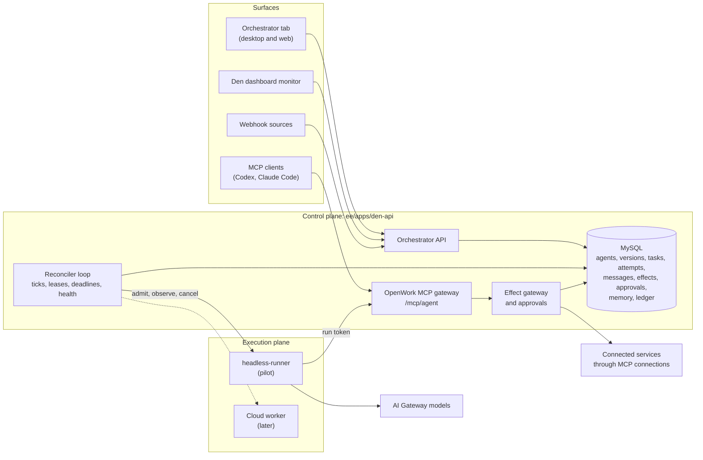
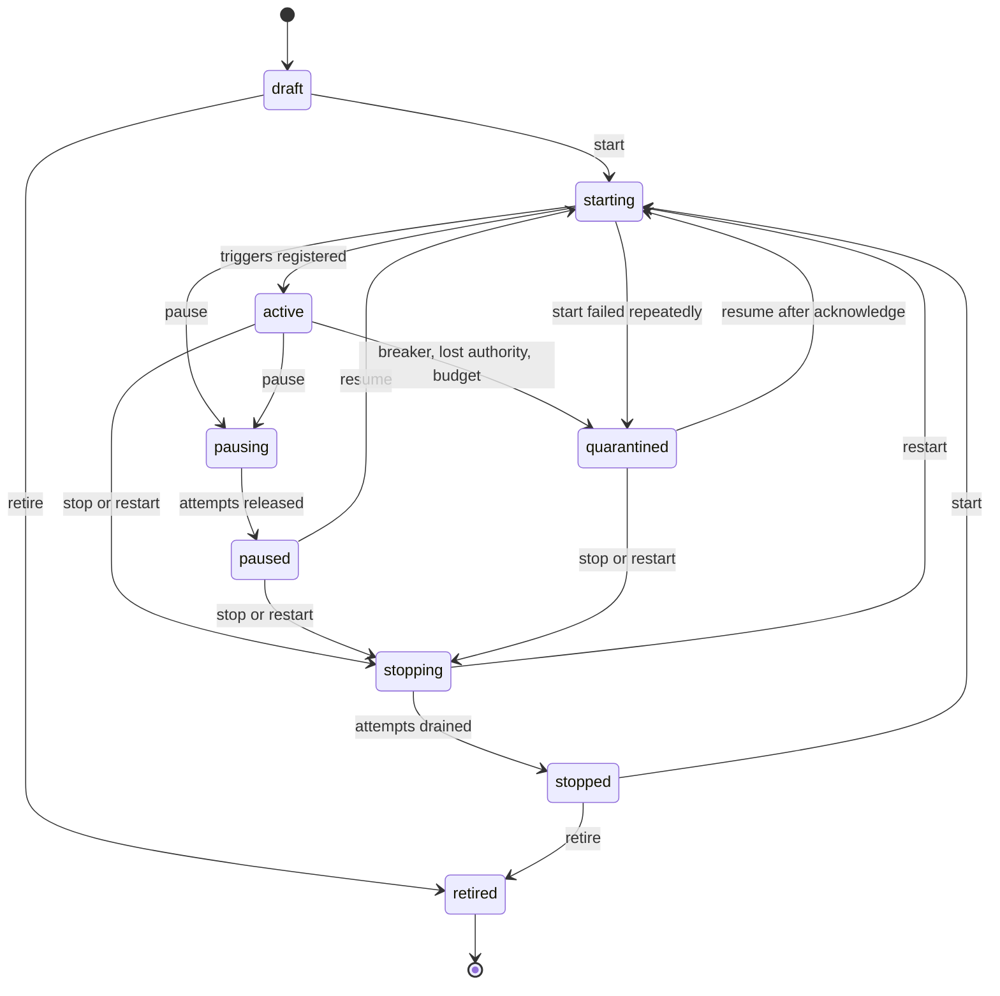
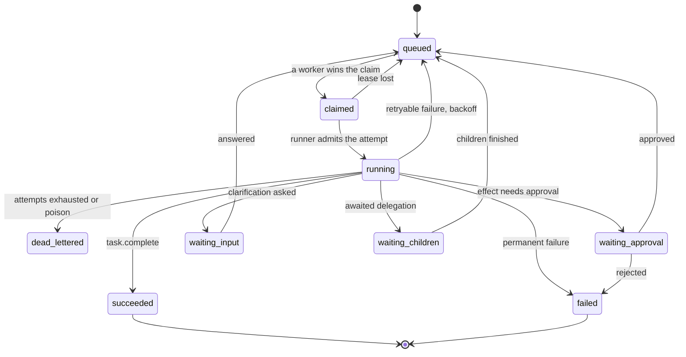

# Orchestrator architecture

Status: proposal. Part of [the orchestrator plan](README.md). Covers brief steps
1, 3, 4 and 5.

## 1. Operating model

### Initial agent types

These six are the pilot set, with a seventh, the `coordinator`, that supervises them. They are
described fully in [sample-process.md](sample-process.md) and configured in `examples/agents/`.

| Agent | Role kind | Run mode | Reads untrusted input | Tools | Hands work to | Approval |
| --- | --- | --- | --- | --- | --- | --- |
| `intake` | dispatcher | continuous, every 60 s | yes | read the inbox | `research`, as a new process | none |
| `research` | worker | event | yes | read the knowledge base | `drafter` | none |
| `drafter` | worker | event | no | save a draft in the workspace (reversible) | `reviewer` | none |
| `reviewer` | reviewer | event | no | read the knowledge base | `sender`, or back to `drafter` | none |
| `sender` | executor | event | no | send a reply (external write) | none | always |
| `digest` | monitor | schedule, daily | no | inspect the queue, notify | none | none |
| `coordinator` | manager | event | no | delegate, inspect the queue, notify | `research`, `reviewer`, `sender` | none |

Two rules shape this set. An agent that reads content an outsider can write
holds no tool that changes the outside world. The only agent that changes the
outside world holds nothing else, and a person approves each thing it does.

### Run modes

Every trigger produces a task. Agents only ever process tasks.

| Mode | What wakes it | How it is built |
| --- | --- | --- |
| `event` | A task addressed to it becomes claimable: a delegation, a webhook event, or an operator submission | The default. Claimed by the reconciler's dispatcher from the queue |
| `schedule` | A time slot | The reconciler enqueues one `schedule.tick` task per slot with the key `tick:<agentId>:<slot>`, so two replicas or a restart cannot enqueue it twice. Missed slots follow the bounded recovery in `@openwork/automations` |
| `continuous` | Its previous tick finishing | The reconciler keeps exactly one `continuous.tick` task outstanding. When it ends, the next is enqueued `tickIntervalMs` later. Each tick is a bounded attempt |

"Long-lived" comes from the loop, not from a process. There is never an
unbounded model conversation to lose. A crash is a lost lease, and the next
tick runs on schedule.

Time-driven agents produce work and consume none; event agents consume work and
may extend the process they are in. Only time-driven agents may start a new
process (`limits.maxNewProcessesPerAttempt`), which keeps the number of
processes bounded by tick cadence.

### Delegation and completion

- An agent delegates with `delegate_task` (see [messaging.md](messaging.md)); at the agent's edge
  that is an A2A `SendMessage` (see [a2a.md](a2a.md)). The
  child is a new task with `parentTaskId`, the same `correlationId`, `hop + 1`,
  and the sender appended to `path`.
- `await: false` hands off and carries on. `await: true` parks the sender in
  `waiting_children` until every awaited child is terminal; the sender's next
  attempt resumes from its checkpoint with the results.
- An agent finishes with `task.complete` (a schema-checked `result`) or
  `task.fail` (an error class and whether to retry).
- A process is complete when its root and every descendant are terminal. It is
  `succeeded` only if all of them are.
- Status updates and clarification questions are messages on the task's thread.
  People see them live.
- An agent that cannot decide something asks its manager first. Every agent except the root has
  exactly one manager, recorded apart from its configuration, with a control degree, a
  dependency degree and a level at which it must escalate. A question or decision goes to the
  nearest manager that is running, then up the chain, and past the root to a person. A manager
  agent can add an internal approval; it never replaces a person's approval of an external write
  or an irreversible action. See [hierarchy.md](hierarchy.md).

### Discovery

The registry of active agents is the set of their **Agent Cards**, generated from
each agent's active configuration ([a2a.md](a2a.md)). The card says who the agent is,
what it can be asked (its skills, each tied to a task type it accepts), and how to
reach it. The Orchestrator tab lists them, and routing by role or capability reads the
same data.

## 2. System context



## 3. Components and where they live

| Component | Responsibility | Location (proposed) |
| --- | --- | --- |
| Wire types | Zod schemas and inferred types shared by API, app and runners | `packages/types/src/orchestrator.ts` |
| Domain | State machines, config validation, loop guards, key derivation, ledger hashing, ports, repository conformance suite. No infrastructure | `packages/agent-orchestrator` |
| Persistence | Drizzle tables and migrations | `ee/packages/den-db/src/schema/orchestrator.ts`, generated with `pnpm --dir ee/packages/den-db db:generate` |
| Service | Repository over MySQL, reconciler, claim and lease logic, effect gateway, approvals, budgets | `ee/apps/den-api/src/agent-orchestrator/` |
| Routes | Org-scoped HTTP, SSE, runner protocol, webhook intake | `ee/apps/den-api/src/routes/org/orchestrator.ts` and a runner route group |
| MCP tools | Run-scoped orchestrator tools and external task submission | `ee/apps/den-api/src/mcp/` |
| Runner adapters | Translate an attempt into a runner call | `ee/apps/den-api/src/agent-orchestrator/runners/` |
| App | The tab and its views | `apps/app/src/react-app/domains/orchestrator/` |

The domain package has no runtime adapter, exactly like `@openwork/automations`.

## 4. Invariants

These are the properties the tests in [test-plan.md](test-plan.md) assert. Each
is checkable from the database alone.

| Id | Invariant |
| --- | --- |
| I1 | A task is committed to MySQL before the caller is told it exists |
| I2 | A task has at most one live lease, and every write by an attempt is fenced by its lease owner and attempt id |
| I3 | A lost lease never loses a task: it is re-queued, retried or dead-lettered |
| I4 | One `(organization, idempotencyKey)` creates at most one task, message or effect |
| I5 | An effect runs only if its intent row exists, policy allows it, and, when required, an approval bound to the same argument digest is granted |
| I6 | Every change to an agent, version, task outcome, approval, limit or kill switch writes one ledger entry in the same transaction |
| I7 | An attempt never has more authority than its active config version intersected with its owner's current authority |
| I8 | A process never exceeds its hop, task-count, cost and time caps |
| I9 | Paused, stopped, quarantined and retired agents start no attempts, and the kill switch overrides every agent |
| I10 | Secrets never appear in configs, payloads, messages, memory, logs, the ledger or model context |

## 5. Agent lifecycle

Operators set a **desired state**; the reconciler moves the **observed state**
toward it. The user-facing `state` is the observed one.



| Command | From | Meaning |
| --- | --- | --- |
| `start` | `draft` (with an active version), `stopped` | Register triggers, reserve capacity, begin claiming |
| `pause` | `starting`, `active` | Stop claiming. In-flight attempts finish the current step, write a checkpoint and release their lease. Queued work stays queued |
| `resume` | `paused`, `quarantined` | Claim again. From `quarantined` it needs an acknowledgement note, which resets the breaker |
| `restart` | `active`, `paused`, `quarantined` | `stop`, then `start` on the currently active version, with `restartGeneration` incremented so attempts from the old generation are fenced out |
| `stop` | `active`, `paused`, `quarantined` | Pause, then cancel what is still running after the drain window. Owned tasks go back to `queued` without spending an attempt |
| `retire` | `draft`, `stopped` | Terminal. Needs no open tasks, or a reassignment target. Versions and history stay readable |

`quarantined` is the system's own pause. Causes: the circuit breaker (5
consecutive failed attempts, or half of the last 20), the owner losing
membership or model access (mirrors `automations/authority.ts`), or an
exhausted budget. It is not an error colour in the UI; see [ui.md](ui.md).

Health is separate from state: `healthy`, `degraded`, `unavailable`, `unknown`,
derived from heartbeat age and recent failure rate.

## 6. Task lifecycle



Not drawn, to keep it readable: any non-terminal state can go to `cancelled`
(operator, or the parent cancelling), and any state except `claimed` can go to
`expired` when `deadlineAt` passes. A task in a `waiting_*` state holds no
worker; resuming is a new attempt that starts from the latest checkpoint.

`failed` means the agent reported a permanent, business-level failure. No retry
helps and no human action is implied unless an escalation rule says so.
`dead_lettered` means the system gave up after retryable failures, a poison
task, or a loop-guard trip, and it needs a person.

A finished task is never reopened. The A2A protocol does not allow a message to a
finished task, and a record that can go back to running is harder to audit. Retrying
work creates a new task (see "Dead letters" below).

## 7. Durable queue

The queue is MySQL. There is no separate broker to lose or to keep consistent
with the database.

### Task row

| Column | Notes |
| --- | --- |
| `id`, `organization_id` | Den TypeIDs |
| `root_task_id`, `parent_task_id`, `correlation_id` | Process lineage. `correlation_id` equals the root id |
| `type`, `payload` | Payload encrypted with `encryptedColumn` |
| `state`, `priority` (0 to 9), `priority_boost` | Effective priority is `priority + boost`; the reconciler adds 1 every 5 minutes of waiting, up to 3, so low priority cannot starve |
| `target_agent_id`, `target_role` | Resolved at enqueue to one agent, least loaded among active agents that accept the type. Unresolvable tasks stay `queued` flagged `unroutable` and raise an attention item after a grace period |
| `not_before`, `deadline_at` | Backoff and expiry |
| `lease_owner`, `lease_expires_at`, `heartbeat_at`, `attempt_count`, `max_attempts` | Same shape as `automation_run` |
| `idempotency_key` | Unique with `organization_id` |
| `hop`, `path`, `taint` | Loop guard inputs; `taint` is explained in [governance.md](governance.md) |
| `classification` | A data class; only agents cleared for it may claim the task |
| `budget_micro_usd`, `spent_micro_usd` | Per-task allocation and spend |
| `result`, `error`, `created_by` | `created_by` is an actor: agent, member or system |
| `origin` | Root tasks only: where the task came from (the Orchestrator, a chat, an MCP client, an event source, a schedule, an outside caller). Ids, never content. It sets the starting `taint`. See [workspaces-and-chat.md](workspaces-and-chat.md) |

Indexes: a claimable index on `(organization_id, target_agent_id, state, not_before)`;
a unique index on `(organization_id, idempotency_key)`; `(root_task_id)`;
`(state, lease_expires_at)` for the reaper; `(deadline_at)`.

### Claiming

The claim is one conditional `UPDATE` followed by a read of the rows this
worker now owns. It uses no `SKIP LOCKED`, because `compatJsonColumn` in
`columns.ts` exists to support MariaDB as well as MySQL.

This differs from the Automations code. `claimCloud` in
`ee/apps/den-api/src/automations/repository.ts` claims inside a serializable
transaction that takes `SELECT … FOR UPDATE` locks on the active rows, which
serializes replicas at the cost of lock contention. The single-statement form
should contend less, but it is a proposal to prove, not a known quantity. The
claim runs at `READ COMMITTED` to avoid gap locks, deadlocks are retried, the
repository conformance suite asserts that two concurrent claimers never win the
same task, and the M7 load test measures it. If it does not hold, the fallback
is the transaction pattern `claimCloud` already uses.

```sql
UPDATE orchestrator_task
SET state = 'claimed', lease_owner = :worker,
    lease_expires_at = NOW(3) + INTERVAL :leaseSeconds SECOND,
    attempt_count = attempt_count + 1
WHERE organization_id = :org AND target_agent_id = :agent
  AND state = 'queued' AND not_before <= NOW(3)
ORDER BY (priority + priority_boost) DESC, created_at ASC
LIMIT :n;

SELECT * FROM orchestrator_task WHERE lease_owner = :worker AND state = 'claimed';
```

Leases compare against the database clock, not a replica's, so clock skew
between Den replicas cannot shorten or extend a lease.

**Concurrency accounting.** Before claiming, the dispatcher runs
`UPDATE orchestrator_agent SET active_attempts = active_attempts + :n WHERE id = :agent AND desired_state = 'running' AND active_attempts + :n <= concurrency`.
Zero rows updated means no claim. The count is decremented when an attempt ends,
and the reaper recomputes it from the attempts table so drift cannot persist.

### Leases and the reaper

- Lease: 60 seconds. Heartbeat every 20 seconds. Both configurable per
  deployment, like `DEN_AUTOMATIONS_LEASE_MS`.
- An attempt whose lease expires is marked `lost`. The task goes back to
  `queued` with backoff if attempts remain, otherwise to `dead_lettered`. A lost
  attempt counts toward `max_attempts`. A task that keeps killing workers is
  therefore a poison task, and it stops.
- A graceful release (shutdown, pause) does not count as an attempt.
- Every write by an attempt carries `lease_owner` and `attempt_id` in its
  `WHERE` clause, so a worker that lost its lease and wakes up later changes
  nothing.

### Deadlines

`deadline_at` is checked at claim, at each heartbeat and by the reaper. A
passed deadline moves a non-terminal task to `expired`, cancels any live
attempt, and tells the parent with a `task.fail` message (`deadline_exceeded`).
An attempt's timeout is the smaller of `limits.maxRuntimeMs` and the time left.

### Dead letters

A task is dead-lettered on exhausted attempts, a poison pattern, or a loop-guard
trip. It stays visible with its reason and every attempt's error. Operators can:

- **Requeue** creates a new task with a fresh attempt budget, carrying the same type
  and payload unless the operator edits it. The new task `supersedes` the dead letter
  and references it (`referenceTaskIds` in A2A terms). The dead letter stays as the
  record; nothing is rewritten.
- **Reassign** to another agent.
- **Discard**, which records a reason.

Each action writes a ledger entry. Dead letters are kept for `deadLetter.holdDays`
(default 90) after resolution.

## 8. Idempotency and side effects

The queue delivers at least once. These keys make repeated delivery harmless.

| Layer | Key | Scope | Behaviour on repeat |
| --- | --- | --- | --- |
| Task creation | Caller key, or derived: `event:<sourceId>:<eventId>`, `tick:<agentId>:<slot>`, `delegate:<parentTaskId>:<hash(type, payload, stepKey)>`, `origin:<agentId>:<stepKey>` | Organization | The existing task is returned |
| Message | `<taskId>:<seq>` | Task | Ignored |
| Model turn | `messageId` = `<attemptId>:<turn>` to the runner | Runner session | `already_present` (the headless runner's existing behaviour) |
| Effect | `effectKey` = SHA-256 of task id, step key, capability id and canonical arguments | Organization | The stored result is returned; the call is not made again |
| Approval | Bound to `(effectKey, argsDigest)` | Effect | A decision applies once |
| Webhook delivery | Source event id, with an HMAC signature and a replay window | Source | The existing task is returned |

The delegation key deliberately omits the attempt id. If a parent crashes after
delegating and its next attempt delegates again, it gets the same child back
instead of a second one.

### The effect gateway

Every non-read call an agent makes passes through one function. Read-only tools
(by their MCP `readOnlyHint`) skip it and are logged as execution events.

1. Compute `effectKey`. Insert an `intent` row. A unique violation means this
   effect was seen before.
2. If a row exists in `done`, return its stored result. Nothing runs.
3. If a row exists in `intent` or `executing` from a lost attempt, its outcome
   is **unknown**. Do not run it again. This is the same rule the headless
   runner already applies to a tool call whose result was never recorded. Then:
   - if the organization has registered a **verifier** for the capability (a
     read-only capability, an argument mapping and a success test), the gateway
     itself runs it. Found: mark `done` and return the stored result. Not
     found: mark the intent abandoned so a fresh intent with the same key can
     run;
   - otherwise, if the tool is annotated `idempotentHint: true`, retry with the
     same downstream idempotency key;
   - otherwise return `effect_outcome_unknown` and raise a "Needs you" item for
     a person to resolve (runbook RB10). The agent's own claim that it checked is never
     enough, because the agent is the party that cannot be trusted to know.
4. Check policy: the agent's allowed tools, the effective risk tier, data
   class, budget. Denials are returned to the agent and written to the ledger.
5. If the tier needs approval, create the approval, move the task to
   `waiting_approval`, and end the attempt. See [governance.md](governance.md).
6. Mark `executing`, call the capability with the downstream idempotency key
   where the target supports one, record the result, mark `done`.

What this guarantees: no effect runs twice from the orchestrator's side, and an
effect whose outcome is unknown is never silently repeated. What it cannot
guarantee: that an external system which does not support idempotency keys saw
the call exactly once when the network failed mid-request. For that case the
plan is the `unknown` state, a gateway-run read-only verifier, and a person when
verification is impossible. Registering a verifier for every external-write
capability an organization uses is part of onboarding that capability.

## 9. Workers and runners

### The runner port

The runner port copies `AutomationEngineAdapter` in
`packages/automations/src/engine.ts`: `capabilities()`, `admit(request)`,
`observe(receipt, options)`, `read(receipt)` and `cancel(receipt)`. The rules
that port already states carry over: the admission key is persisted before
`admit` is called and retrying it returns the same receipt; every observed event
is persisted by its stable key before the cursor advances; after a Den restart
the orchestrator reloads the receipt and cursor, calls `read`, and resumes
`observe` with no in-memory handle.

### Runner targets

| Target | What it is | Pilot | Why |
| --- | --- | --- | --- |
| `headless` | Den calls `ee/apps/headless-runner`: model through the AI Gateway, tools through OpenWork MCP, scratch files only, no shell | Yes | Every external effect passes the gateway, so it can be gated |
| `cloud` | A cloud worker running a native OpenWork thread, as Automations do | After the pilot | Full tool set; shell and local effects are not interceptable, so it needs sandboxing and policy work first |
| `desktop` | The user's machine via the desktop runner | Not in v1 | It sleeps, changes networks and runs local tools the gateway cannot see |

Hybrid deployments place `headless` runners inside a customer network. They
pull work over outbound HTTPS, as the desktop runner does, so no inbound port is
needed.

### Heartbeats, checkpoints, shutdown

- **Heartbeat.** The runner heartbeats the attempt every 20 seconds, carrying
  `attemptId`, step number and token usage. Agent health derives from the
  newest heartbeat.
- **Checkpoint.** After each completed model step that had tool results, the
  runner posts `{ stepIndex, summary, scratch, pendingToolCalls }`. A new
  attempt receives the latest checkpoint and replays finished effects from the
  effect log. The runner's own session store is a cache, never the source of
  truth, so losing a runner's SQLite file loses nothing that matters.
- **Graceful shutdown.** On `SIGTERM` a runner stops claiming, finishes or
  checkpoints within `drainTimeoutMs` (default 30 s), releases its leases with
  reason `shutdown`, and exits. Den replicas stop their reconciler the way
  `startAutomationSchedulerLoop` stops its loop.
- **Run token.** Each attempt gets a token with claims `agentId`, `taskId`,
  `attemptId`, `restartGeneration`, valid for the lease plus a short grace and
  never more than an hour, modelled on `headless-run-token.ts`. The token is
  held in runner memory only and revoked when the attempt ends.

### Where each limit is enforced

| Limit | Enforced by |
| --- | --- |
| Attempt wall-clock | Reconciler watchdog cancels at `maxRuntimeMs`; the headless runner also has its own turn timeout |
| Steps and tokens per attempt | Headless runner step cap and context caps; the orchestrator sets them from the config |
| Cost per attempt, task, day, month | Reserve-before-spend in `orchestrator_budget`; the model call is refused when the reservation fails. Settled from usage events |
| Concurrent attempts | The conditional counter update above |
| Queue depth | Enqueue is refused with `429 queue_full` when `maxQueueDepth` is reached |
| Attempts per hour | The dispatcher stops claiming for the agent |
| Fan-out | `maxChildTasksPerTask` checked at delegation |
| Hops, visits, tasks per process | Loop guards in [governance.md](governance.md) |

## 10. Reconciler and replicas

One loop, run by every Den replica, every `pollIntervalMs` (15 s by default).
Each step is idempotent and uses conditional updates, so replicas do not need
leader election.

1. Enqueue due `schedule.tick` and `continuous.tick` tasks.
2. Reap expired leases; expire passed deadlines and approvals.
3. Reconcile agents toward their desired state.
4. Dispatch: claim queued tasks for active agents with free capacity and admit
   them to runners.
5. Evaluate health, circuit breakers and owner authority.
6. Roll up metrics (a leased singleton job row; see [operations.md](operations.md)).

The Automations desktop-runner notes list multi-replica online presence as
deferred hardening. The orchestrator therefore stores presence and heartbeats in
the database and keeps nothing important in process memory.

The loop can run inside `den-api`, as the Automations scheduler does, or as a
separate deployment of the same image with a role flag. Production should use
the separate deployment so API latency does not depend on loop load. Both modes
use the same code.

## 11. Failure modes

| Failure | What happens | Why nothing is lost or doubled | Test |
| --- | --- | --- | --- |
| Worker killed mid-attempt | Lease expires, attempt marked lost, task re-queued with backoff | I3; effects already `done` replay from the log | R1 |
| Worker killed after effect intent, before result | Next attempt sees `intent`, treats the outcome as unknown; the gateway's verifier, an idempotent retry, or a person settles it | I5; effect log | R2 |
| Den replica killed mid-claim | The conditional update either committed or did not; the other replicas continue | I2; leases use the database clock | R3 |
| Database failover | Writes fail until the new primary is up; callers get 503 and nothing was acknowledged | I1; acknowledgement follows commit | R4 |
| Model provider 5xx or 429 | Retry with backoff; then the fallback model | Same attempt budget; `messageId` makes the runner turn idempotent | R5 |
| Model returns malformed output | One repair prompt, then `task.fail` with `malformed_output` | Counts toward attempts | R5 |
| Tool or connection unavailable | Retry with backoff; expired credentials stop retries and raise "reconnect" | No blind retries on a broken credential | R6 |
| Malformed message from an agent | The tool returns a structured error; two corrections are allowed, then the attempt fails. External malformed input is quarantined, never delivered | Messages are schema-validated at ingress | R7 |
| Poison task | Each crash spends an attempt; at the limit it is dead-lettered | I3 | R8 |
| Duplicate webhook delivery | Same key, same task | I4 | R10 |
| Approval never answered | Expires after `expiresInMs`, task becomes `expired`, escalation runs | Deadline handling | A3 |
| Config activated while attempts run | In-flight attempts keep the version they started with | Attempts pin `agent_version_id` | C5 |
| Runner loses its session store | Next attempt rebuilds from the Den checkpoint | Checkpoints live in Den | R1 |
| Outage ends and the backlog is large | Jittered backoff and a claim-rate cap prevent a thundering herd | Per-agent concurrency counter | R9 |
| Kill switch engaged | No new claims anywhere; live attempts are cancelled at their next heartbeat, at most 20 s | I9 | J5 |
