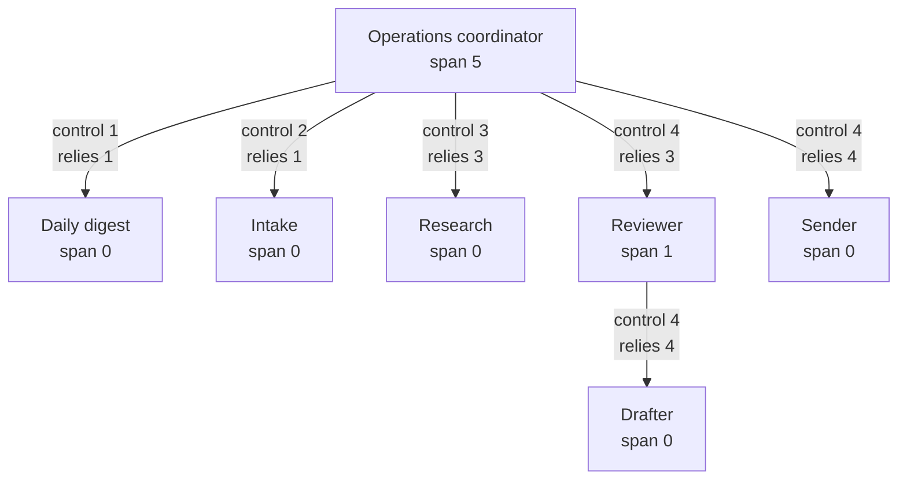

# Management hierarchy: span of control and dependency

Status: proposal. Part of [the orchestrator plan](README.md). Covers the task
"Implement span of control and dependency reporting for agents". The rules below are
real code with tests (`hierarchy.ts`, embedded at the end), and every table and report
on this page is generated from that code, not typed by hand.

## What it is for

Agents already delegate to each other ([messaging.md](messaging.md)) and ask people for
approval ([governance.md](governance.md)). What was missing is who supervises whom. A
reporting hierarchy makes four things explicit:

- **Decision authority.** Who may approve, stop or override an agent's decision, and
  which decisions it may take alone.
- **Escalation.** Where a problem goes when an agent cannot resolve it: its manager,
  then that manager's manager, and, at the top, a person.
- **Workload.** How many agents each manager supervises, and how much work they carry.
- **Accountability.** The relationship between any two agents is a recorded fact, with
  a history, and anyone can look it up from either end.

## The agent register

Each agent already has what the register needs: a unique id (`agt_…`), a unique slug in
the organization, a role (`role.kind`, `responsibilities`), and its state. Two small
additions came with this task:

- `role.kind` gains **`manager`**, for an agent whose job is supervising other agents.
- `role.decisionAuthority` lists, in plain sentences, what the agent may decide on its
  own. It is shown in the register and is separate from permissions, which the
  orchestrator enforces.

The requirement's example ids (`AG-001`) are display names, not identifiers. The
register uses the existing ids, and a short organization-wide code can be added if it
is wanted (see the open questions).

## The relationship record

One record per manager and reporting agent, kept apart from both agents'
configuration so it has its own history. Fields, with the requirement's names beside
them:

| Field | Meaning | Requirement's name |
| --- | --- | --- |
| `managerAgentId` | The agent giving direction | Manager agent |
| `reportingAgentId` | The agent receiving it | Reporting agent |
| `relationshipType` | Only `direct` is stored. Indirect is derived from the chain | Relationship type |
| `controlDegree` | 1 to 5: the manager's authority | Control degree |
| `dependencyDegree` | 1 to 5: the report's reliance, stored separately | Dependency degree |
| `escalation.requiredFromLevel` | The lowest impact level at which the report must escalate to its manager | `escalation_required_from_level` |
| `escalation.alsoWhen` | Situations that always escalate: blocked, repeated failure, budget at risk, deadline at risk, policy conflict | Escalation conditions |
| `state`, `startedAt`, `endedAt`, `revision` | A relationship is ended, never deleted; every change bumps `revision` and writes a ledger entry | |

The span of control is **not** stored. It is counted from the active relationships
whenever it is read, so it is correct after every add, removal and reassignment with
nothing to recalculate.

```json
{
  "id": "rel_01j9z8r2k4a3",
  "managerAgentId": "agt_01j9z8q2k4m0",
  "reportingAgentId": "agt_01j9z8q2k4m3",
  "relationshipType": "direct",
  "controlDegree": 4,
  "dependencyDegree": 3,
  "escalation": {
    "requiredFromLevel": 3,
    "alsoWhen": [
      "repeated_failure",
      "policy_conflict",
      "deadline_at_risk"
    ]
  },
  "state": "active",
  "startedAt": "2026-10-01T08:00:00.000Z",
  "endedAt": null,
  "revision": 1
}
```

This is the coordinator's relationship with the reviewer: control High, dependency
Moderate, escalate from impact level 3.

## The scale

Control and dependency use the same five levels, stored separately. A manager may hold
High control over an agent that still relies on it only at Low, because the agent does
most of its work independently.

| Degree | Name | Control: what the manager can do | Dependency: what the agent relies on |
| --- | --- | --- | --- |
| 1 | Very low | The agent operates almost independently. | Works almost independently of its manager. |
| 2 | Low | The manager provides occasional direction. | Looks to its manager for occasional direction. |
| 3 | Moderate | The manager approves important decisions. | Waits for its manager on important decisions. |
| 4 | High | The manager directs priorities and approves most actions. | Takes priorities from its manager and waits for approval on most actions. |
| 5 | Full | The agent cannot make or execute relevant decisions without the manager's approval. | Cannot make or execute relevant decisions without its manager. |

## What each control degree allows

The requirement leaves the powers open, so this plan fixes them. A higher degree never
grants less (checked). Each cell is what a manager of that degree may do to one report.

| Power | 1 Very low | 2 Low | 3 Moderate | 4 High | 5 Full |
| --- | --- | --- | --- | --- | --- |
| See outputs and logs | Yes | Yes | Yes | Yes | Yes |
| Set priorities | — | Advisory (agent may decline, with a reason) | Binding | Binding | Binding |
| Assign work | — | Request (agent may reject) | Binding | Binding | Binding |
| Approve decisions | — | — | Important decisions | Most actions | Every decision |
| Stop an action | — | — | — | Yes | Yes |
| Override a decision | — | — | — | — | Yes |
| Reassign the agent's work | — | — | — | Yes | Yes |

Boundaries that apply at every degree:

- **A manager never widens its report.** It cannot give the report a tool, a larger
  budget or a higher data class than the report's own configuration allows. Its powers
  act on decisions and work, not on configuration.
- **A manager agent never stands in for a person.** An external write or an
  irreversible action still needs a person's approval at every control degree; a
  manager's approval is an additional internal gate, never a replacement
  ([governance.md](governance.md)).
- **Changing who an agent reports to is not a manager power.** "Reassign" here moves a
  report's queued work to another report. Moving the agent itself to a different
  manager is a change to the hierarchy, and only a person can make it.
- **Seeing outputs and logs follows data classes.** A manager sees content only up to
  the data classes it is cleared for, and metadata otherwise.
- **Every exercise is recorded.** Stopping an action, overriding a decision and
  reassigning work are ledger entries naming both agents.

## What each dependency degree relies on

What the reporting agent waits for or receives from its manager, from the agent's side.
"Key items" means the decisions, outputs or exceptions at or above the relationship's
escalation level.

| Relies on the manager for | 1 Very low | 2 Low | 3 Moderate | 4 High | 5 Full |
| --- | --- | --- | --- | --- | --- |
| Instructions | — | Occasionally | Key items | Most | Everything |
| Data | — | — | Occasionally | Key items | Everything |
| Approval | — | — | Key items | Most | Everything |
| Resources | — | — | Occasionally | Most | Everything |
| Exception handling | — | Occasionally | Key items | Most | Everything |
| Escalation | Occasionally | Occasionally | Key items | Most | Everything |
| Final validation | — | — | Key items | Most | Everything |

## Span of control

> Span of control = the number of **active direct-report relationships** the manager
> has.

- Indirect reports are never counted. The reviewer's span is 1 (the drafter); the
  coordinator's is 5, not 6, even though the drafter is below it.
- An agent counts unless it is a **draft** (not yet supervised) or **retired**. Paused,
  stopped and quarantined agents still count, because they still need supervision.
- The limit is an organization setting, **7 by default**, which is a proposal to
  confirm. `spanEnforcement` is `flag` by default: a manager over the limit appears in
  the exceptions report and the change is allowed with a warning. `block` also refuses
  the change that would cause it.

## What is refused and what is flagged

Checked on every write; a refused change returns its reasons and writes nothing.

| Rule | Code | Result |
| --- | --- | --- |
| An agent cannot report to itself | `self_report` | Refused |
| No reporting loops, at any depth | `cycle` | Refused, with the path named |
| No duplicate direct-report relationship | `duplicate_relationship` | Refused |
| One direct manager only (no matrix reporting) | `second_manager` | Refused |
| Control and dependency must be whole numbers from 1 to 5 | schema | Refused |
| The root agent has no manager | `root_cannot_report` | Refused |
| Both agents must exist and neither may be retired | `unknown_agent`, `retired_agent` | Refused |
| A manager that still supervises agents cannot be retired | `has_active_reports` | Refused; reassign its reports first |
| A manager would exceed the span limit | `span_over_limit` | Flagged; refused in `block` mode |
| An agent other than the root has no manager | `no_manager` | Flagged |
| No root agent is designated | `no_root` | Flagged |
| A report relies (degree 3 or more) on a manager that is paused, stopped or quarantined | `dependent_on_unavailable_manager` | Flagged |
| Control and dependency differ by 3 or more | `large_control_dependency_gap` | Information |
| Loops, two managers, or a manager on the root found in stored data | `cycle_detected`, `second_manager`, `root_has_manager` | Flagged as errors; the write path cannot create them |

Draft agents may have no manager while they are set up. Starting an agent requires one
(or that it is the root).

## Both directions

- **Manager to controlled agents.** `directReports(manager)` lists each direct report
  with its control degree, dependency degree and whether it counts toward the span.
- **Agent to its manager.** `managerOf(agent)` gives the manager, the dependency degree
  and the escalation rule. `reportingChain(agent)` gives the whole chain to the root.
- **Escalation path.** `escalationPath(agent)` lists each manager up the chain and
  whether it is running. An escalation goes to the nearest manager that is `active`;
  with none, it goes to a person. A paused manager is skipped, not waited for.
- **Decisions.** `decisionRoute(relationship, { impact, tier })` answers three
  questions for an action: must the report escalate (impact at or above the
  relationship's level), does its manager have to approve (from the control degree),
  and does a person have to approve (any external write or irreversible action, always).

## The five outputs

All five are produced by the same functions the tests run. The examples are the sample
organization: a coordinator over five agents, with the drafter under the reviewer.

### 1. The hierarchy diagram



### 2. The span-of-control report

| Manager | Level | Direct reports | Span | Limit | Over limit | Queued | Running |
| --- | --- | --- | --- | --- | --- | --- | --- |
| Operations coordinator | 0 | Daily digest, Intake, Research, Reviewer, Sender | 5 | 7 | No | 4 | 2 |
| Reviewer | 1 | Drafter | 1 | 7 | No | 0 | 0 |

Detail for each manager:

| Manager | Reports | Type | Control | Relies on manager |
| --- | --- | --- | --- | --- |
| Operations coordinator | Daily digest | direct | Very low (1) | Very low (1) |
| Operations coordinator | Intake | direct | Low (2) | Very low (1) |
| Operations coordinator | Research | direct | Moderate (3) | Moderate (3) |
| Operations coordinator | Reviewer | direct | High (4) | Moderate (3) |
| Operations coordinator | Sender | direct | High (4) | High (4) |
| Reviewer | Drafter | direct | High (4) | High (4) |

### 3. The agent dependency report

| Agent | Level | Manager | Dependency | Manager controls at | Escalates from impact | Escalation path |
| --- | --- | --- | --- | --- | --- | --- |
| Operations coordinator | 0 | — (root) | — | — | — | a person |
| Daily digest | 1 | Operations coordinator | Very low (1) | Very low (1) | 5 | coordinator → a person |
| Drafter | 2 | Reviewer | High (4) | High (4) | 3 | reviewer → coordinator → a person |
| Intake | 1 | Operations coordinator | Very low (1) | Low (2) | 5 | coordinator → a person |
| Research | 1 | Operations coordinator | Moderate (3) | Moderate (3) | 4 | coordinator → a person |
| Reviewer | 1 | Operations coordinator | Moderate (3) | High (4) | 3 | coordinator → a person |
| Sender | 1 | Operations coordinator | High (4) | High (4) | 2 | coordinator → a person |

### 4. Exceptions and threshold breaches

A healthy hierarchy has none. This scenario has four: the reviewer is paused while the
drafter relies on it, the coordinator's limit is lowered to 4, a new archivist has no
manager, and the intake agent's control and dependency disagree.

| Severity | Code | Message |
| --- | --- | --- |
| warning | `dependent_on_unavailable_manager` | Drafter relies on Reviewer (High), which is paused. |
| warning | `no_manager` | Archivist has no manager and is not the root agent. |
| warning | `span_over_limit` | Operations coordinator supervises 5 agents; the limit is 4. |
| info | `large_control_dependency_gap` | Operations coordinator controls Intake at Full but it relies on them at Very low. |

### 5. The full relationship matrix

Managers down the side, reporting agents across the top. Each cell is control / dependency.

| Manager | Daily digest | Drafter | Intake | Research | Reviewer | Sender |
| --- | --- | --- | --- | --- | --- | --- |
| Operations coordinator | 1 / 1 | — | 2 / 1 | 3 / 3 | 4 / 3 | 4 / 4 |
| Reviewer | — | 4 / 4 | — | — | — | — |

The same data, as JSON, is in `examples/hierarchy/` (`relationship-matrix.json` and the
others).

## How it fits the rest of the plan

| Area | Rule |
| --- | --- |
| Delegation | The hierarchy does not replace `permissions.delegateTo`. It adds implied rights along its edges: a manager may assign work to a report it controls at degree 2 or more, and a report may escalate to its manager. Both are limited to task types the target accepts, and both are subject to the hop, visit and fan-out guards |
| Approvals | A manager agent can satisfy an **internal** approval. It can never satisfy one for an external write or an irreversible action, which stay with a person ([governance.md](governance.md)) |
| Escalation | A clarification with audience `manager` goes to the manager as a `decision.requested` task. If it is unavailable the question moves up the chain, and past the root it becomes a "Needs you" item for a person |
| A2A | The hierarchy is orchestrator-internal. Over A2A a manager's direction is an ordinary message, and the hierarchy is not published on Agent Cards. Remote agents cannot be placed in it ([a2a.md](a2a.md)) |
| Permissions | Changing the hierarchy needs the same right as activating a version (`orchestrator.activate`), because it changes who has authority. Agents can recommend a change; they cannot make one |
| Ledger | `hierarchy.relationship_created`, `hierarchy.relationship_changed`, `hierarchy.relationship_ended`, `hierarchy.policy_changed`, and `hierarchy.manager_action` for stop, override and reassign-work |
| Data classes | A manager's view of a report's content is limited to the manager's own data classes |
| Workload | The span report totals queued and running work across a manager's direct reports, from the existing rollups |

## Where it lives

- **Pure rules:** `packages/agent-orchestrator` (the code below).
- **Table:** `orchestrator_reporting_relationship`, one row per relationship, with a
  partial unique index that allows one active manager per agent.
- **Policy:** `rootAgentId`, `maxSpanOfControl` and `spanEnforcement` in the
  organization policy ([governance.md](governance.md)).
- **API:** [api.md](api.md), "Hierarchy".
- **Interface:** the Hierarchy view in [ui.md](ui.md). It reads the reports and offers
  "Change manager" with the validation messages above.
- **Milestones:** [delivery-plan.md](delivery-plan.md).

## How it is tested

The reference implementation passes 97 checks (group H in [test-plan.md](test-plan.md)). Beyond the
requirement's own scenarios (add and remove agents, reassign, recalculate the span,
several levels, loop prevention, both directions), it checks that the scales are
complete and never decrease, that reports do not depend on input order, that corrupt
stored data cannot hang the reports, and that these examples match what the code
produces. As a check on the checks, seven rules were broken on purpose (loop detection,
the second-manager rule, counting indirect reports, counting drafts, letting a manager
replace a person's approval, the duplicate rule, retiring a manager with reports); the
suite failed each time.

## Assumptions to confirm

These are the points the requirement left open and the choice this plan makes.

1. **The agent list and who reports to whom.** The sample organization is illustrative.
2. **The top-level agent.** One root, designated in the organization policy. The sample
   uses the coordinator.
3. **The scale.** The five levels and their meanings are as given. What each level
   allows and relies on (the two tables above) is this plan's proposal.
4. **The span limit.** 7, flagged rather than blocked.
5. **Matrix reporting.** Not permitted; an agent has one direct manager.
6. **"Active".** Every agent that is not a draft or retired. A paused agent counts.
7. **"Escalation required from level".** Read as the lowest impact level, on the same
   five levels, at which the report must escalate to its manager.
8. **"Reassign the agent".** Read as moving the agent's work. Moving the agent to a
   different manager is a person's change.
9. **Identifiers.** The existing ids and slugs. A display code such as `AG-001` is an
   addition if wanted.
10. **Platform.** Den and the Orchestrator tab, as in the rest of this plan.

## The code

<details>
<summary>hierarchy.ts: the relationship record, scales, validation, views and reports</summary>

```ts
import { z } from "zod"
import { roleKindSchema, type RiskTier } from "./agent-config"
import type { AgentState } from "./states"

type RoleKind = z.infer<typeof roleKindSchema>

// --- the five-level scale, used for both control and dependency --------------

export const degreeSchema = z.union([z.literal(1), z.literal(2), z.literal(3), z.literal(4), z.literal(5)])
export type Degree = z.infer<typeof degreeSchema>
export const degrees: readonly Degree[] = [1, 2, 3, 4, 5]

export const degreeNames: Record<Degree, string> = { 1: "Very low", 2: "Low", 3: "Moderate", 4: "High", 5: "Full" }

/** The manager's authority over a report. */
export const controlMeaning: Record<Degree, string> = {
  1: "The agent operates almost independently.",
  2: "The manager provides occasional direction.",
  3: "The manager approves important decisions.",
  4: "The manager directs priorities and approves most actions.",
  5: "The agent cannot make or execute relevant decisions without the manager's approval.",
}

/** The report's reliance on its manager. Stored separately from control. */
export const dependencyMeaning: Record<Degree, string> = {
  1: "Works almost independently of its manager.",
  2: "Looks to its manager for occasional direction.",
  3: "Waits for its manager on important decisions.",
  4: "Takes priorities from its manager and waits for approval on most actions.",
  5: "Cannot make or execute relevant decisions without its manager.",
}

// --- what each control degree allows ------------------------------------------

export const controlPowerSchema = z.enum([
  "see_outputs_and_logs", "set_priorities", "assign_work", "approve_decisions",
  "stop_action", "override_decision", "reassign_work",
])
export type ControlPower = z.infer<typeof controlPowerSchema>

export type ControlGrant = "none" | "advisory" | "request" | "binding" | "important" | "most" | "all" | "yes"

/**
 * - advisory: the agent may decline a priority, with a reason.
 * - request: the agent may reject assigned work with `task.reject`.
 * - important: decisions at or above the relationship's escalation level.
 * - most: every action above `read`, and any decision at or above the escalation level.
 * - all: every decision.
 * `reassign_work` moves the report's queued work to another report. Changing who an agent reports to is
 * never a manager power; only a person can do it.
 * Seeing outputs and logs is limited to data classes the manager is cleared for.
 */
export const controlTable: Record<Degree, Record<ControlPower, ControlGrant>> = {
  1: { see_outputs_and_logs: "yes", set_priorities: "none", assign_work: "none", approve_decisions: "none", stop_action: "none", override_decision: "none", reassign_work: "none" },
  2: { see_outputs_and_logs: "yes", set_priorities: "advisory", assign_work: "request", approve_decisions: "none", stop_action: "none", override_decision: "none", reassign_work: "none" },
  3: { see_outputs_and_logs: "yes", set_priorities: "binding", assign_work: "binding", approve_decisions: "important", stop_action: "none", override_decision: "none", reassign_work: "none" },
  4: { see_outputs_and_logs: "yes", set_priorities: "binding", assign_work: "binding", approve_decisions: "most", stop_action: "yes", override_decision: "none", reassign_work: "yes" },
  5: { see_outputs_and_logs: "yes", set_priorities: "binding", assign_work: "binding", approve_decisions: "all", stop_action: "yes", override_decision: "yes", reassign_work: "yes" },
}

/** Each power's grants from weakest to strongest; a higher degree never gets a weaker grant. */
export const grantOrder: Record<ControlPower, readonly ControlGrant[]> = {
  see_outputs_and_logs: ["yes"],
  set_priorities: ["none", "advisory", "binding"],
  assign_work: ["none", "request", "binding"],
  approve_decisions: ["none", "important", "most", "all"],
  stop_action: ["none", "yes"],
  override_decision: ["none", "yes"],
  reassign_work: ["none", "yes"],
}

// --- what each dependency degree relies on -------------------------------------

export const dependencyNeedSchema = z.enum([
  "instructions", "data", "approval", "resources", "exception_handling", "escalation", "final_validation",
])
export type DependencyNeed = z.infer<typeof dependencyNeedSchema>

export type DependencyLevel = "none" | "occasional" | "key_items" | "most" | "all"
export const dependencyOrder: readonly DependencyLevel[] = ["none", "occasional", "key_items", "most", "all"]

export const dependencyTable: Record<Degree, Record<DependencyNeed, DependencyLevel>> = {
  1: { instructions: "none", data: "none", approval: "none", resources: "none", exception_handling: "none", escalation: "occasional", final_validation: "none" },
  2: { instructions: "occasional", data: "none", approval: "none", resources: "none", exception_handling: "occasional", escalation: "occasional", final_validation: "none" },
  3: { instructions: "key_items", data: "occasional", approval: "key_items", resources: "occasional", exception_handling: "key_items", escalation: "key_items", final_validation: "key_items" },
  4: { instructions: "most", data: "key_items", approval: "most", resources: "most", exception_handling: "most", escalation: "most", final_validation: "most" },
  5: { instructions: "all", data: "all", approval: "all", resources: "all", exception_handling: "all", escalation: "all", final_validation: "all" },
}

// --- the relationship record -----------------------------------------------------

export const escalationTriggerSchema = z.enum([
  "blocked", "repeated_failure", "budget_at_risk", "deadline_at_risk", "policy_conflict",
])

/** Stored once per manager and reporting agent. "Indirect" is derived from the chain and never stored. */
export const reportingRelationshipSchema = z.strictObject({
  id: z.string().regex(/^[a-z]{2,12}_[0-9a-z]{8,40}$/),
  managerAgentId: z.string().min(1),
  reportingAgentId: z.string().min(1),
  relationshipType: z.enum(["direct"]),
  controlDegree: degreeSchema,
  dependencyDegree: degreeSchema,
  escalation: z.strictObject({
    /** The lowest impact level (same five levels) at which the report must escalate to its manager. */
    requiredFromLevel: degreeSchema,
    /** Situations that always escalate, whatever the impact. */
    alsoWhen: z.array(escalationTriggerSchema).max(5).default([]),
  }),
  state: z.enum(["active", "ended"]),
  startedAt: z.iso.datetime(),
  endedAt: z.iso.datetime().nullable(),
  /** Bumped on every change; the ledger records each one. */
  revision: z.number().int().positive(),
})
export type ReportingRelationship = z.infer<typeof reportingRelationshipSchema>

export type ProposedRelationship = Pick<
  ReportingRelationship,
  "managerAgentId" | "reportingAgentId" | "relationshipType" | "controlDegree" | "dependencyDegree" | "escalation"
>

export type HierarchyAgent = {
  id: string
  slug: string
  displayName: string
  roleKind: RoleKind
  state: AgentState
}

export type HierarchyPolicy = {
  /** The single top-level agent. It has no manager. */
  rootAgentId: string | null
  /** The agreed limit on active direct reports. */
  maxSpanOfControl: number
  /** `flag` reports a manager over the limit; `block` also refuses the change that caused it. */
  spanEnforcement: "flag" | "block"
}

/** Drafts are not yet supervised and retired agents are gone; every other state counts. */
export function countsTowardSpan(agent: HierarchyAgent): boolean {
  return agent.state !== "draft" && agent.state !== "retired"
}

// --- indexes and the two directions ------------------------------------------------

const bySlug = <T extends { slug: string }>(left: T, right: T) => left.slug.localeCompare(right.slug)

type Edge = { agent: HierarchyAgent; relationship: ReportingRelationship }

function activeRelationships(relationships: readonly ReportingRelationship[]) {
  return relationships.filter((relationship) => relationship.state === "active")
}

function agentMap(agents: readonly HierarchyAgent[]) {
  return new Map(agents.map((agent) => [agent.id, agent]))
}

/** Manager to controlled agents, with each control degree. Includes agents that do not count toward the span. */
export function directReports(
  agents: readonly HierarchyAgent[], relationships: readonly ReportingRelationship[], managerId: string,
): Edge[] {
  const map = agentMap(agents)
  return activeRelationships(relationships)
    .filter((relationship) => relationship.managerAgentId === managerId)
    .flatMap((relationship) => {
      const agent = map.get(relationship.reportingAgentId)
      return agent ? [{ agent, relationship }] : []
    })
    .sort((left, right) => bySlug(left.agent, right.agent))
}

/** Span of control: active direct-report relationships only. Indirect reports are never counted. */
export function spanOfControl(
  agents: readonly HierarchyAgent[], relationships: readonly ReportingRelationship[], managerId: string,
): number {
  return directReports(agents, relationships, managerId).filter((edge) => countsTowardSpan(edge.agent)).length
}

/** Agent to the manager it depends on, with the dependency degree. */
export function managerOf(
  agents: readonly HierarchyAgent[], relationships: readonly ReportingRelationship[], agentId: string,
): { manager: HierarchyAgent; relationship: ReportingRelationship } | null {
  const map = agentMap(agents)
  for (const relationship of activeRelationships(relationships)) {
    if (relationship.reportingAgentId !== agentId) continue
    const manager = map.get(relationship.managerAgentId)
    if (manager) return { manager, relationship }
  }
  return null
}

/** The agent, its manager, theirs, and so on to the root. `cycle` is true if corrupt data loops. */
export function reportingChain(
  agents: readonly HierarchyAgent[], relationships: readonly ReportingRelationship[], agentId: string,
): { chain: HierarchyAgent[]; cycle: boolean } {
  const map = agentMap(agents)
  const chain: HierarchyAgent[] = []
  const seen = new Set<string>()
  let currentId: string | null = agentId
  while (currentId !== null) {
    if (seen.has(currentId)) return { chain, cycle: true }
    seen.add(currentId)
    const agent = map.get(currentId)
    if (!agent) break
    chain.push(agent)
    currentId = managerOf(agents, relationships, currentId)?.manager.id ?? null
  }
  return { chain, cycle: false }
}

/** Everyone below a manager, direct reports excluded. For display only; never part of the span. */
export function indirectReports(
  agents: readonly HierarchyAgent[], relationships: readonly ReportingRelationship[], managerId: string,
): HierarchyAgent[] {
  const direct = new Set(directReports(agents, relationships, managerId).map((edge) => edge.agent.id))
  const found = new Map<string, HierarchyAgent>()
  const visited = new Set<string>([managerId])
  const queue = [...direct]
  while (queue.length > 0) {
    const id = queue.shift()
    if (id === undefined || visited.has(id)) continue
    visited.add(id)
    for (const edge of directReports(agents, relationships, id)) {
      if (!direct.has(edge.agent.id)) found.set(edge.agent.id, edge.agent)
      queue.push(edge.agent.id)
    }
  }
  return [...found.values()].sort(bySlug)
}

// --- validation -----------------------------------------------------------------------

export const issueCodeSchema = z.enum([
  "unknown_agent", "retired_agent", "self_report", "root_cannot_report", "duplicate_relationship",
  "second_manager", "cycle", "span_over_limit", "has_active_reports",
  "no_root", "no_manager", "root_has_manager", "cycle_detected",
  "dependent_on_unavailable_manager", "large_control_dependency_gap",
])
export type HierarchyIssueCode = z.infer<typeof issueCodeSchema>

export type HierarchyIssue = {
  code: HierarchyIssueCode
  severity: "error" | "warning" | "info"
  message: string
  agentId?: string
  relationshipId?: string
}

export type HierarchyState = {
  agents: readonly HierarchyAgent[]
  relationships: readonly ReportingRelationship[]
  policy: HierarchyPolicy
}

/** Everything that stops a relationship being written. Warnings (a span over the limit) do not stop it unless enforcement is `block`. */
export function validateProposed(
  state: HierarchyState, proposed: ProposedRelationship, replaces?: string,
): HierarchyIssue[] {
  const issues: HierarchyIssue[] = []
  const map = agentMap(state.agents)
  const manager = map.get(proposed.managerAgentId)
  const report = map.get(proposed.reportingAgentId)
  if (!manager) issues.push({ code: "unknown_agent", severity: "error", agentId: proposed.managerAgentId, message: "The manager is not in the agent register." })
  if (!report) issues.push({ code: "unknown_agent", severity: "error", agentId: proposed.reportingAgentId, message: "The reporting agent is not in the agent register." })
  if (!manager || !report) return issues

  if (manager.state === "retired") issues.push({ code: "retired_agent", severity: "error", agentId: manager.id, message: `${manager.displayName} is retired and cannot supervise.` })
  if (report.state === "retired") issues.push({ code: "retired_agent", severity: "error", agentId: report.id, message: `${report.displayName} is retired and cannot report to anyone.` })
  if (manager.id === report.id) issues.push({ code: "self_report", severity: "error", agentId: manager.id, message: `${manager.displayName} cannot report to itself.` })
  if (state.policy.rootAgentId === report.id) issues.push({ code: "root_cannot_report", severity: "error", agentId: report.id, message: `${report.displayName} is the root agent and has no manager.` })

  const others = activeRelationships(state.relationships).filter((relationship) => relationship.id !== replaces)
  if (others.some((relationship) => relationship.managerAgentId === manager.id && relationship.reportingAgentId === report.id)) {
    issues.push({ code: "duplicate_relationship", severity: "error", message: `${report.displayName} already reports directly to ${manager.displayName}.` })
  }
  const existing = others.find((relationship) => relationship.reportingAgentId === report.id && relationship.managerAgentId !== manager.id)
  if (existing) {
    const current = map.get(existing.managerAgentId)
    issues.push({ code: "second_manager", severity: "error", agentId: report.id, relationshipId: existing.id, message: `${report.displayName} already reports to ${current?.displayName ?? existing.managerAgentId}. An agent has one direct manager.` })
  }

  // A cycle exists if the manager is the report or already sits below it.
  const withoutReplaced = state.relationships.filter((relationship) => relationship.id !== replaces)
  const upward = reportingChain(state.agents, withoutReplaced, manager.id).chain
  if (manager.id !== report.id && upward.some((agent) => agent.id === report.id)) {
    const path = [report, ...upward.slice(0, upward.findIndex((agent) => agent.id === report.id)).reverse()].map((agent) => agent.displayName)
    issues.push({ code: "cycle", severity: "error", agentId: report.id, message: `This would create a reporting loop: ${[...path, report.displayName].join(" → ")}.` })
  }

  if (countsTowardSpan(report)) {
    const spanAfter = directReports(state.agents, withoutReplaced, manager.id).filter((edge) => countsTowardSpan(edge.agent) && edge.agent.id !== report.id).length + 1
    if (spanAfter > state.policy.maxSpanOfControl) {
      issues.push({
        code: "span_over_limit",
        severity: state.policy.spanEnforcement === "block" ? "error" : "warning",
        agentId: manager.id,
        message: `${manager.displayName} would have ${spanAfter} direct reports; the limit is ${state.policy.maxSpanOfControl}.`,
      })
    }
  }
  return issues
}

export type ChangeResult =
  | { ok: true; relationships: ReportingRelationship[]; warnings: HierarchyIssue[] }
  | { ok: false; issues: HierarchyIssue[] }

type Clock = { now: string; newId: () => string }

export function addRelationship(state: HierarchyState, proposed: ProposedRelationship, clock: Clock): ChangeResult {
  const issues = validateProposed(state, proposed)
  if (issues.some((issue) => issue.severity === "error")) return { ok: false, issues }
  const created: ReportingRelationship = {
    id: clock.newId(), ...proposed, state: "active", startedAt: clock.now, endedAt: null, revision: 1,
  }
  return { ok: true, relationships: [...state.relationships, created], warnings: issues }
}

/** Ends the current relationship and starts the new one together; history is kept. Changing a manager is never automatic. */
export function reassign(
  state: HierarchyState,
  change: { reportingAgentId: string; newManagerAgentId: string; controlDegree?: Degree; dependencyDegree?: Degree; escalation?: ProposedRelationship["escalation"] },
  clock: Clock,
): ChangeResult {
  const current = activeRelationships(state.relationships).find((relationship) => relationship.reportingAgentId === change.reportingAgentId)
  if (!current) {
    return { ok: false, issues: [{ code: "no_manager", severity: "error", agentId: change.reportingAgentId, message: "There is no current relationship to reassign; add one instead." }] }
  }
  const proposed: ProposedRelationship = {
    managerAgentId: change.newManagerAgentId,
    reportingAgentId: change.reportingAgentId,
    relationshipType: current.relationshipType,
    controlDegree: change.controlDegree ?? current.controlDegree,
    dependencyDegree: change.dependencyDegree ?? current.dependencyDegree,
    escalation: change.escalation ?? current.escalation,
  }
  const issues = validateProposed(state, proposed, current.id)
  if (issues.some((issue) => issue.severity === "error")) return { ok: false, issues }
  const ended: ReportingRelationship = { ...current, state: "ended", endedAt: clock.now, revision: current.revision + 1 }
  const created: ReportingRelationship = { id: clock.newId(), ...proposed, state: "active", startedAt: clock.now, endedAt: null, revision: 1 }
  return { ok: true, relationships: [...state.relationships.map((relationship) => (relationship.id === current.id ? ended : relationship)), created], warnings: issues }
}

export type RetireResult =
  | { ok: true; agents: HierarchyAgent[]; relationships: ReportingRelationship[] }
  | { ok: false; issues: HierarchyIssue[] }

/** Retiring a manager that still supervises agents is refused; its reports are reassigned first. */
export function retireAgent(state: HierarchyState, agentId: string, clock: Clock): RetireResult {
  const agent = state.agents.find((candidate) => candidate.id === agentId)
  if (!agent) return { ok: false, issues: [{ code: "unknown_agent", severity: "error", agentId, message: "The agent is not in the register." }] }
  const reports = directReports(state.agents, state.relationships, agentId).filter((edge) => edge.agent.state !== "retired")
  if (reports.length > 0) {
    return { ok: false, issues: [{ code: "has_active_reports", severity: "error", agentId, message: `${agent.displayName} still supervises ${reports.length} agent${reports.length === 1 ? "" : "s"}. Reassign them first.` }] }
  }
  return {
    ok: true,
    agents: state.agents.map((candidate) => (candidate.id === agentId ? { ...candidate, state: "retired" } : candidate)),
    relationships: state.relationships.map((relationship) => (
      relationship.state === "active" && relationship.reportingAgentId === agentId
        ? { ...relationship, state: "ended", endedAt: clock.now, revision: relationship.revision + 1 }
        : relationship
    )),
  }
}

// --- decisions: when a report must go to its manager ---------------------------------

/**
 * What an action by the report needs. `humanApproval` does not depend on the hierarchy: a manager agent
 * can never stand in for a person on an external write or an irreversible action.
 */
export function decisionRoute(
  relationship: ReportingRelationship, action: { impact: Degree; tier: RiskTier },
): { escalate: boolean; managerApproval: boolean; humanApproval: boolean } {
  const escalate = action.impact >= relationship.escalation.requiredFromLevel
  const grant = controlTable[relationship.controlDegree].approve_decisions
  const managerApproval = grant === "all"
    || (grant === "most" && (action.tier !== "read" || escalate))
    || (grant === "important" && escalate)
  return { escalate, managerApproval, humanApproval: action.tier === "external_write" || action.tier === "irreversible" }
}

/** Where an escalation goes: each manager up the chain that is running, then a person. */
export function escalationPath(
  agents: readonly HierarchyAgent[], relationships: readonly ReportingRelationship[], agentId: string,
): { steps: Array<{ agent: HierarchyAgent; available: boolean }>; firstAvailable: HierarchyAgent | null; endsWithPerson: true } {
  const chain = reportingChain(agents, relationships, agentId).chain.slice(1)
  const steps = chain.map((agent) => ({ agent, available: agent.state === "active" }))
  return { steps, firstAvailable: steps.find((step) => step.available)?.agent ?? null, endsWithPerson: true }
}

// --- the five outputs --------------------------------------------------------------------

export type AgentRef = HierarchyAgent
export type Workload = Record<string, { queued: number; running: number }>

export type TreeNode = {
  agent: AgentRef
  level: number
  span: number
  controlDegree: Degree | null
  dependencyDegree: Degree | null
  children: TreeNode[]
}

function levelOf(agents: readonly HierarchyAgent[], relationships: readonly ReportingRelationship[], agentId: string) {
  return Math.max(0, reportingChain(agents, relationships, agentId).chain.length - 1)
}

/** 1. The hierarchy diagram: every active agent that has no manager is a top of its own tree, so orphans stay visible. */
export function hierarchyTree(agents: readonly HierarchyAgent[], relationships: readonly ReportingRelationship[]): TreeNode[] {
  const build = (agent: HierarchyAgent, edge: Edge | null, seen: Set<string>): TreeNode => ({
    agent,
    level: levelOf(agents, relationships, agent.id),
    span: spanOfControl(agents, relationships, agent.id),
    controlDegree: edge?.relationship.controlDegree ?? null,
    dependencyDegree: edge?.relationship.dependencyDegree ?? null,
    children: directReports(agents, relationships, agent.id)
      .filter((child) => !seen.has(child.agent.id) && child.agent.state !== "retired")
      .map((child) => build(child.agent, child, new Set([...seen, child.agent.id]))),
  })
  return agents
    .filter((agent) => agent.state !== "retired" && managerOf(agents, relationships, agent.id) === null)
    .sort(bySlug)
    .map((agent) => build(agent, null, new Set([agent.id])))
}

export type SpanRow = {
  manager: AgentRef
  level: number
  span: number
  limit: number
  overLimit: boolean
  indirectReportCount: number
  directReports: Array<{
    agent: AgentRef
    relationshipType: "direct"
    controlDegree: Degree
    controlName: string
    dependencyDegree: Degree
    dependencyName: string
    countsTowardSpan: boolean
  }>
  workload?: { queued: number; running: number }
}

/** 2. The span-of-control report: one row per manager. */
export function spanOfControlReport(state: HierarchyState, workload?: Workload): SpanRow[] {
  const { agents, relationships, policy } = state
  return agents
    .filter((agent) => agent.state !== "retired" && directReports(agents, relationships, agent.id).length > 0)
    .map((manager): SpanRow => {
      const edges = directReports(agents, relationships, manager.id)
      const span = edges.filter((edge) => countsTowardSpan(edge.agent)).length
      const totals = workload
        ? edges.reduce((sum, edge) => ({
            queued: sum.queued + (workload[edge.agent.id]?.queued ?? 0),
            running: sum.running + (workload[edge.agent.id]?.running ?? 0),
          }), { queued: 0, running: 0 })
        : undefined
      return {
        manager,
        level: levelOf(agents, relationships, manager.id),
        span,
        limit: policy.maxSpanOfControl,
        overLimit: span > policy.maxSpanOfControl,
        indirectReportCount: indirectReports(agents, relationships, manager.id).length,
        directReports: edges.map((edge) => ({
          agent: edge.agent,
          relationshipType: edge.relationship.relationshipType,
          controlDegree: edge.relationship.controlDegree,
          controlName: degreeNames[edge.relationship.controlDegree],
          dependencyDegree: edge.relationship.dependencyDegree,
          dependencyName: degreeNames[edge.relationship.dependencyDegree],
          countsTowardSpan: countsTowardSpan(edge.agent),
        })),
        ...(totals ? { workload: totals } : {}),
      }
    })
    .sort((left, right) => right.span - left.span || bySlug(left.manager, right.manager))
}

export type DependencyRow = {
  agent: AgentRef
  level: number
  manager: AgentRef | null
  relationshipType: "direct" | null
  controlDegree: Degree | null
  dependencyDegree: Degree | null
  dependencyName: string | null
  reliesOn: Record<DependencyNeed, DependencyLevel> | null
  managerMay: Record<ControlPower, ControlGrant> | null
  escalatesFromLevel: Degree | null
  escalationPath: string[]
}

/** 3. The dependency report: one row per active agent, looking up. */
export function dependencyReport(state: HierarchyState): DependencyRow[] {
  const { agents, relationships } = state
  return agents
    .filter((agent) => agent.state !== "retired")
    .sort(bySlug)
    .map((agent): DependencyRow => {
      const link = managerOf(agents, relationships, agent.id)
      const relationship = link?.relationship
      return {
        agent,
        level: levelOf(agents, relationships, agent.id),
        manager: link?.manager ?? null,
        relationshipType: relationship?.relationshipType ?? null,
        controlDegree: relationship?.controlDegree ?? null,
        dependencyDegree: relationship?.dependencyDegree ?? null,
        dependencyName: relationship ? degreeNames[relationship.dependencyDegree] : null,
        reliesOn: relationship ? dependencyTable[relationship.dependencyDegree] : null,
        managerMay: relationship ? controlTable[relationship.controlDegree] : null,
        escalatesFromLevel: relationship?.escalation.requiredFromLevel ?? null,
        escalationPath: escalationPath(agents, relationships, agent.id).steps.map((step) => step.agent.slug),
      }
    })
}

/** 4. Exceptions and threshold breaches, most serious first. */
export function hierarchyExceptions(state: HierarchyState): HierarchyIssue[] {
  const { agents, relationships, policy } = state
  const issues: HierarchyIssue[] = []
  const supervised = agents.filter(countsTowardSpan)
  const map = agentMap(agents)

  if (policy.rootAgentId === null) {
    issues.push({ code: "no_root", severity: "warning", message: "No root agent is designated." })
  } else if (managerOf(agents, relationships, policy.rootAgentId)) {
    issues.push({ code: "root_has_manager", severity: "error", agentId: policy.rootAgentId, message: "The root agent has a manager." })
  }
  for (const agent of supervised) {
    if (agent.id !== policy.rootAgentId && managerOf(agents, relationships, agent.id) === null) {
      issues.push({ code: "no_manager", severity: "warning", agentId: agent.id, message: `${agent.displayName} has no manager and is not the root agent.` })
    }
    const managers = activeRelationships(relationships).filter((relationship) => relationship.reportingAgentId === agent.id)
    if (managers.length > 1) {
      issues.push({ code: "second_manager", severity: "error", agentId: agent.id, message: `${agent.displayName} has ${managers.length} direct managers.` })
    }
    if (reportingChain(agents, relationships, agent.id).cycle) {
      issues.push({ code: "cycle_detected", severity: "error", agentId: agent.id, message: `${agent.displayName} is part of a reporting loop.` })
    }
  }
  for (const row of spanOfControlReport(state)) {
    if (row.overLimit) {
      issues.push({ code: "span_over_limit", severity: "warning", agentId: row.manager.id, message: `${row.manager.displayName} supervises ${row.span} agents; the limit is ${row.limit}.` })
    }
  }
  for (const relationship of activeRelationships(relationships)) {
    const manager = map.get(relationship.managerAgentId)
    const report = map.get(relationship.reportingAgentId)
    if (!manager || !report || !countsTowardSpan(report)) continue
    if (relationship.dependencyDegree >= 3 && ["paused", "pausing", "stopping", "stopped", "quarantined"].includes(manager.state)) {
      issues.push({ code: "dependent_on_unavailable_manager", severity: "warning", agentId: report.id, relationshipId: relationship.id, message: `${report.displayName} relies on ${manager.displayName} (${degreeNames[relationship.dependencyDegree]}), which is ${manager.state}.` })
    }
    if (Math.abs(relationship.controlDegree - relationship.dependencyDegree) >= 3) {
      issues.push({ code: "large_control_dependency_gap", severity: "info", agentId: report.id, relationshipId: relationship.id, message: `${manager.displayName} controls ${report.displayName} at ${degreeNames[relationship.controlDegree]} but it relies on them at ${degreeNames[relationship.dependencyDegree]}.` })
    }
  }
  const rank = { error: 0, warning: 1, info: 2 }
  return issues.sort((left, right) => rank[left.severity] - rank[right.severity] || left.code.localeCompare(right.code) || (left.agentId ?? "").localeCompare(right.agentId ?? ""))
}

export type MatrixReport = {
  reports: AgentRef[]
  rows: Array<{ manager: AgentRef; cells: Array<{ controlDegree: Degree; dependencyDegree: Degree } | null> }>
}

/** 5. The full relationship matrix: managers down the side, reporting agents across the top. */
export function relationshipMatrix(state: HierarchyState): MatrixReport {
  const { agents, relationships } = state
  const reports = agents
    .filter((agent) => agent.state !== "retired" && managerOf(agents, relationships, agent.id) !== null)
    .sort(bySlug)
  const managers = agents
    .filter((agent) => agent.state !== "retired" && directReports(agents, relationships, agent.id).length > 0)
    .sort(bySlug)
  return {
    reports,
    rows: managers.map((manager) => ({
      manager,
      cells: reports.map((report) => {
        const edge = directReports(agents, relationships, manager.id).find((candidate) => candidate.agent.id === report.id)
        return edge ? { controlDegree: edge.relationship.controlDegree, dependencyDegree: edge.relationship.dependencyDegree } : null
      }),
    })),
  }
}
```

</details>
