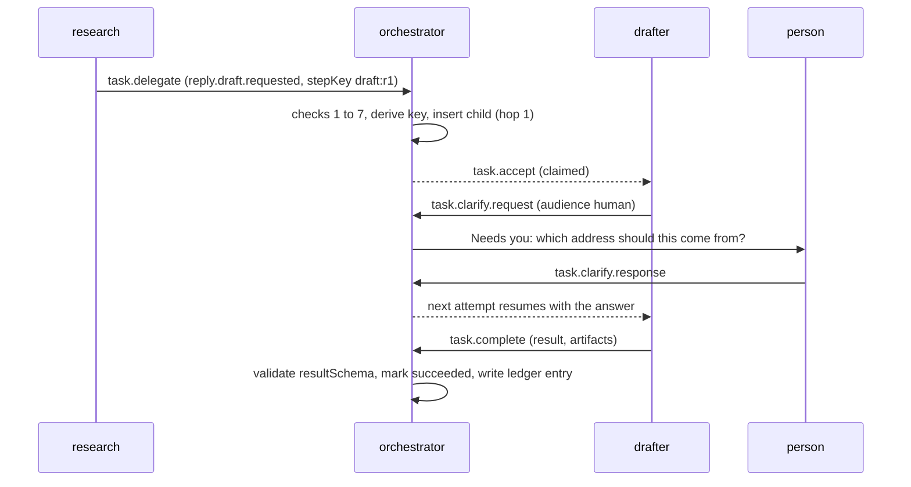

# Agent-to-agent messaging

Status: proposal. Part of [the orchestrator plan](README.md). Covers brief step 6.

## Principles

- **Agents never talk to each other directly.** Every message goes through the
  orchestrator, so permissions, loop guards, budgets, validation and the
  history apply to every exchange.
- **Strict contracts.** Each message type has its own body schema. Unknown
  fields are rejected. A malformed message is never delivered.
- **Append-only.** A message is never edited. A correction is a new message.
- **At-least-once, deduplicated.** Every message has an idempotency key, so a
  repeated send is a no-op.
- **References, not blobs.** Bodies are capped at 64 KiB. Larger content is an
  artifact in the workspace, passed by reference.
- **Messages are data.** A receiving agent's instructions say so, and the
  orchestrator wraps message bodies as quoted data when it builds a model
  context. Nothing in a body can change the receiver's configuration.

## Relationship to A2A

At the edge of every agent these messages are presented as A2A messages, tasks and
artifacts, and a message from another A2A agent arrives as one of them. The types
below stay because they carry what A2A does not: hop count, path, taint, sequence
number and idempotency keys. [a2a.md](a2a.md) has the full mapping, the A2A state each
task state projects to, and the rules about identity and idempotency. The short form:
a delegation is a `SendMessage`, a question is `INPUT_REQUIRED`, an approval wait is
`AUTH_REQUIRED`, a result is an artifact on a `COMPLETED` task, and a finished task is
never reopened.

## Message types

| Type | Sent by | Purpose | Effect on tasks |
| --- | --- | --- | --- |
| `task.delegate` | agent, member | Create a task for another agent, or start a process | Creates the child. `await: true` parks the sender in `waiting_children` |
| `task.accept` | system | The task was claimed | `claimed` |
| `task.reject` | agent | "I cannot take this": `not_my_type`, `overloaded`, `permission_denied`, `invalid_payload` | Task returns to `queued` for another agent, or fails if none |
| `task.status` | agent | Progress for people and monitors | None |
| `task.clarify.request` | agent | Ask the delegator or a person a question | `waiting_input`; see below |
| `task.clarify.response` | agent (as delegator), member | The answer | Back to `queued` |
| `task.complete` | agent | Finished, with a structured `result` | `succeeded` |
| `task.fail` | agent | Could not finish: error class, code, retryable | `failed`, or retry, or dead letter |
| `approval.request` | system | An effect needs a decision | `waiting_approval` |
| `approval.decision` | system | Approved, rejected, expired or withdrawn | Resumes or ends the task |
| `event.received` | system | A webhook event arrived for an event trigger | Creates the task the trigger names |
| `control` | system, member | Cancel, reprioritise, pause or resume | As named |

Agents can send only the types whose "Sent by" column includes agent. The
orchestrator writes everything else, so an agent cannot forge an approval
decision or claim that a task was accepted.

## The contract

This is the normative draft, as code. It compiles under `strict` TypeScript with
Zod 4 and becomes part of `packages/types/src/orchestrator.ts` in milestone M1.
It also holds the approval card payload and the ledger entry, which share the
same ids and actors.

```ts
import { z } from "zod"
import { errorClassSchema, riskTierSchema, roleKindSchema } from "./agent-config"

/** Den TypeIDs look like `<prefix>_<suffix>`; the prefixes here are illustrative until M2. */
const idSchema = z.string().regex(/^[a-z]{2,12}_[0-9a-z]{8,40}$/)
const timestampSchema = z.iso.datetime()
const sha256Schema = z.string().regex(/^[0-9a-f]{64}$/)
const jsonObjectSchema = z.record(z.string(), z.json())

// --- who and where -----------------------------------------------------------

export const actorSchema = z.discriminatedUnion("kind", [
  z.strictObject({ kind: z.literal("agent"), agentId: idSchema }),
  z.strictObject({ kind: z.literal("member"), memberId: idSchema }),
  z.strictObject({
    kind: z.literal("system"),
    component: z.enum(["api", "scheduler", "reconciler", "event_source", "gateway"]),
  }),
])

/** Agents never address a process directly; the orchestrator resolves the address to one agent. */
export const addressSchema = z.discriminatedUnion("kind", [
  z.strictObject({ kind: z.literal("agent"), agentId: idSchema }),
  z.strictObject({ kind: z.literal("role"), role: roleKindSchema }),
  z.strictObject({ kind: z.literal("member"), memberId: idSchema }),
  z.strictObject({ kind: z.literal("thread") }),
])

/**
 * Where a root task came from. Identifiers only: a chat's content is never copied into the
 * orchestrator, so the link can say "started from this chat" without holding what was said.
 */
export const originSchema = z.discriminatedUnion("kind", [
  z.strictObject({ kind: z.literal("member_ui") }),
  z.strictObject({
    kind: z.literal("chat"),
    surface: z.enum(["desktop", "web"]),
    workspaceId: z.string().min(1).max(200),
    sessionId: z.string().min(1).max(200),
  }),
  z.strictObject({ kind: z.literal("mcp_client"), client: z.string().min(1).max(80) }),
  z.strictObject({ kind: z.literal("event_source"), sourceId: z.string().min(1).max(160) }),
  z.strictObject({ kind: z.literal("schedule") }),
  z.strictObject({ kind: z.literal("a2a_caller"), callerId: z.string().min(1).max(160) }),
])
export type Origin = z.infer<typeof originSchema>

/**
 * Text that did not come from a person typing into the Orchestrator is untrusted input: a chat
 * may have read a web page, and an outside caller is outside. Such a task starts tainted, so
 * it cannot reach an external write without a person's approval (governance.md, "Taint").
 */
export function originTaintsTask(origin: Origin): boolean {
  return origin.kind !== "member_ui" && origin.kind !== "schedule"
}

// --- message bodies, one per type --------------------------------------------

const delegateBody = z.strictObject({
  taskType: z.string().regex(/^[a-z][a-z0-9_.-]{1,62}$/),
  payload: jsonObjectSchema,
  priority: z.number().int().min(0).max(9).optional(),
  deadlineAt: timestampSchema.optional(),
  /** true parks the sender in `waiting_children` until the child finishes. */
  await: z.boolean().default(false),
  /** true starts a new process (a new root task) instead of extending this one. Time-driven agents only. */
  newProcess: z.boolean().default(false),
  maxCostMicroUsd: z.number().int().nonnegative().safe().optional(),
})

const artifactRefSchema = z.strictObject({ ref: z.string().min(1).max(200), kind: z.string().min(1).max(40) })

const bodies = {
  "task.delegate": delegateBody,
  "task.reject": z.strictObject({
    reason: z.enum(["not_my_type", "overloaded", "permission_denied", "invalid_payload"]),
    detail: z.string().max(500).optional(),
  }),
  "task.status": z.strictObject({
    phase: z.enum(["started", "working", "blocked", "finishing"]),
    message: z.string().min(1).max(500),
    progress: z.number().min(0).max(1).optional(),
  }),
  "task.clarify.request": z.strictObject({
    /** `manager` asks the agent's direct manager; if it is unavailable the question moves up the chain, then to a person. */
    audience: z.enum(["delegator", "manager", "human"]),
    question: z.string().min(1).max(1_000),
    options: z.array(z.string().min(1).max(200)).max(8).optional(),
    expiresAt: timestampSchema.optional(),
  }),
  "task.clarify.response": z.strictObject({
    requestMessageId: idSchema,
    answer: z.string().min(1).max(2_000),
  }),
  "task.complete": z.strictObject({
    summary: z.string().min(1).max(500),
    result: jsonObjectSchema,
    artifacts: z.array(artifactRefSchema).max(10).default([]),
  }),
  "task.fail": z.strictObject({
    errorClass: errorClassSchema.or(z.enum(["permanent", "policy"])),
    code: z.string().min(1).max(64),
    message: z.string().min(1).max(500),
    retryable: z.boolean(),
  }),
}

/** What an agent may send. Everything else is written by the orchestrator. */
export const outboundMessageSchema = z.discriminatedUnion("type", [
  z.strictObject({ type: z.literal("task.delegate"), to: z.discriminatedUnion("kind", [
    z.strictObject({ kind: z.literal("agent"), agentId: idSchema }),
    z.strictObject({ kind: z.literal("role"), role: roleKindSchema }),
  ]), stepKey: z.string().min(1).max(100).optional(), body: bodies["task.delegate"] }),
  z.strictObject({ type: z.literal("task.reject"), body: bodies["task.reject"] }),
  z.strictObject({ type: z.literal("task.status"), body: bodies["task.status"] }),
  z.strictObject({ type: z.literal("task.clarify.request"), body: bodies["task.clarify.request"] }),
  z.strictObject({ type: z.literal("task.clarify.response"), body: bodies["task.clarify.response"] }),
  z.strictObject({ type: z.literal("task.complete"), body: bodies["task.complete"] }),
  z.strictObject({ type: z.literal("task.fail"), body: bodies["task.fail"] }),
])
export type OutboundMessage = z.infer<typeof outboundMessageSchema>

// --- the stored envelope -----------------------------------------------------

const envelopeBase = {
  schemaVersion: z.literal(1),
  messageId: idSchema,
  idempotencyKey: z.string().min(1).max(200),
  /** The root task id; every message in one process shares it. */
  correlationId: idSchema,
  /** The message or task that caused this one. */
  causationId: idSchema.nullable(),
  taskId: idSchema,
  /** Monotonic per task; defines display and replay order. */
  seq: z.number().int().positive(),
  from: actorSchema,
  to: addressSchema,
  sentAt: timestampSchema,
  /** Delegation hops from the root; compared with the loop guard. */
  hop: z.number().int().min(0).max(32),
  /** Agent ids the work has passed through, root first. */
  path: z.array(idSchema).max(16),
}

const envelope = <Type extends string, Body extends z.ZodType>(type: Type, body: Body) =>
  z.strictObject({ ...envelopeBase, type: z.literal(type), body })

export const messageEnvelopeSchema = z.discriminatedUnion("type", [
  envelope("task.delegate", bodies["task.delegate"]),
  envelope("task.accept", z.strictObject({ attemptId: idSchema })),
  envelope("task.reject", bodies["task.reject"]),
  envelope("task.status", bodies["task.status"]),
  envelope("task.clarify.request", bodies["task.clarify.request"]),
  envelope("task.clarify.response", bodies["task.clarify.response"].extend({ answeredBy: actorSchema })),
  envelope("task.complete", bodies["task.complete"]),
  envelope("task.fail", bodies["task.fail"]),
  envelope("approval.request", z.strictObject({ approvalId: idSchema })),
  envelope("approval.decision", z.strictObject({
    approvalId: idSchema,
    decision: z.enum(["approved", "rejected", "expired", "withdrawn"]),
    decidedBy: actorSchema.nullable(),
  })),
  envelope("event.received", z.strictObject({
    sourceId: z.string().min(1).max(160),
    eventId: z.string().min(1).max(200),
    eventType: z.string().min(1).max(63),
    payload: jsonObjectSchema,
  })),
  envelope("control", z.strictObject({
    command: z.enum(["cancel", "reprioritize", "pause_agent", "resume_agent"]),
    reason: z.string().max(300).optional(),
  })),
])
export type MessageEnvelope = z.infer<typeof messageEnvelopeSchema>

// --- the approval card (DESIGN.md P9 and T4: action, data, risk) -------------

export const approvalRequestSchema = z.strictObject({
  approvalId: idSchema,
  taskId: idSchema,
  attemptId: idSchema,
  agentId: idSchema,
  effectKey: sha256Schema,
  capability: z.string().min(1).max(200),
  tier: riskTierSchema,
  /** One sentence each, shown verbatim on the card. */
  action: z.string().min(1).max(200),
  data: z.string().min(1).max(500),
  risk: z.string().min(1).max(300),
  reversible: z.boolean(),
  /** Hash of the exact arguments. A decision binds to this and to nothing else. */
  argsDigest: sha256Schema,
  /** Redacted preview of the arguments for the card; the full value stays encrypted server-side. */
  argsPreview: jsonObjectSchema,
  minApprovals: z.number().int().min(1).max(3),
  expiresAt: timestampSchema,
})
export type ApprovalRequest = z.infer<typeof approvalRequestSchema>

// --- the governance ledger ---------------------------------------------------

export const ledgerEntrySchema = z.strictObject({
  /** Gapless per organisation. */
  seq: z.number().int().positive(),
  organizationId: idSchema,
  at: timestampSchema,
  actor: actorSchema,
  action: z.string().regex(/^[a-z_]+(\.[a-z_]+)+$/),
  subject: z.strictObject({ type: z.string().min(1).max(40), id: idSchema }),
  outcome: z.enum(["succeeded", "failed", "denied"]),
  /** Digests, not copies: the immutable version rows hold the content. */
  before: sha256Schema.nullable(),
  after: sha256Schema.nullable(),
  changedFields: z.array(z.string().max(200)).max(100).default([]),
  reasonCode: z.string().max(64).optional(),
  requestId: z.string().max(128).nullable(),
  prevHash: sha256Schema,
  /** sha256(prevHash || canonical(entry without entryHash)). */
  entryHash: sha256Schema,
})
export type LedgerEntry = z.infer<typeof ledgerEntrySchema>
```

### What agents send and what is stored

An agent calls an orchestrator tool with `outboundMessageSchema` (type and body,
and for a delegation the target). The orchestrator fills in everything in
`envelopeBase`: ids, `seq`, `from`, `hop`, `path`, `correlationId`,
`causationId` and the idempotency key. The agent cannot set any of those.

### Examples

A delegation from the researcher to the drafter:

```json
{
  "type": "task.delegate",
  "to": {"kind": "agent", "agentId": "agt_01j9z8q2k4m7"},
  "stepKey": "draft:r1",
  "body": {
    "taskType": "reply.draft.requested",
    "payload": {"requestId": "r1", "facts": ["Order shipped on 2026-09-28"]},
    "await": false
  }
}
```

A completion:

```json
{
  "type": "task.complete",
  "body": {
    "summary": "Drafted a reply using 3 facts",
    "result": {"draftRef": "ws://drafts/r1.md", "factsUsed": 3},
    "artifacts": [{"ref": "ws://drafts/r1.md", "kind": "draft"}]
  }
}
```

## Delegation

A delegation is accepted only if all of these hold. Each check has a distinct
error code, and each denial is a ledger entry.

1. The sending agent has `delegate_task` and the target is in its
   `permissions.delegateTo` (a slug, or `role:<kind>`).
2. The target is active and accepts the `taskType`, and the payload passes the
   target's `payloadSchema` if it has one. A failed payload check returns
   `invalid_payload` to the sender, who can correct it.
3. The new `hop` does not exceed the organization's hop cap (default 12).
4. The target's `maxVisitsPerProcess` is not exceeded by the current `path`.
5. The sender's `maxChildTasksPerTask` and the process's task cap (default 50)
   are not exceeded.
6. If `newProcess` is true, the sender is a schedule or continuous agent and is
   under `maxNewProcessesPerAttempt`.
7. Any `maxCostMicroUsd` fits inside what the parent has left, and the child's
   data classification is not above what the target is cleared for.

Derived fields on the child: `parentTaskId`, `rootTaskId` (itself, for a new
process), `hop + 1`, `path` plus the sender, `taint` inherited from the parent,
and the idempotency key
`delegate:<parentTaskId>:<hash(taskType, payload, stepKey)>` (or
`origin:<agentId>:<stepKey>` for a new process). The key omits the attempt id,
so a parent that crashes and re-delegates gets the same child, not a second one.

## Addressing and routing

`to` is an agent, a role, a member, or the thread. A role address is resolved
when the task is enqueued to one agent: active, accepting the type, cleared for
the data class, with the lowest load. The choice is stored on the task, so
retries go to the same agent unless it is reassigned. Agents never see or choose
a process, host or URL.

## Status, clarification, completion

- **Status.** `task.status` shows in the live view and the task timeline. It
  never changes task state. At most one per 5 seconds per task is stored; extra
  ones in that window replace the previous.
- **Clarification to a person.** The task goes to `waiting_input` and holds no
  worker. The question appears in the Orchestrator's "Needs you" list with the
  options, if any. The answer is a `task.clarify.response` from the member; the
  task returns to `queued` and its next attempt gets the answer in context.
- **Clarification to the delegator.** If the parent is awaiting this child, the
  parent moves from `waiting_children` to `queued` so it can read the question.
  It answers with `task.clarify.response`, which returns the child to `queued`
  and the parent to `waiting_children`. A parent that is not waiting cannot be
  asked; the agent should ask a person instead.
- **Clarification to a manager.** `audience: "manager"` sends the question to the asking
  agent's manager as a `decision.requested` task, which the manager's configuration must
  accept. If the manager is not `active`, the question moves up the reporting chain; past the
  root it becomes a "Needs you" item for a person. The manager answers with
  `task.clarify.response`. See [hierarchy.md](hierarchy.md). An agent with no manager cannot
  use this audience (`no_manager`).
- **Questions expire.** An unanswered question expires with `expiresAt` or the
  task deadline, and the escalation rules run.
- **Completion.** The `result` must pass the accepting agent's `resultSchema`
  if one is defined. A failing result is returned to the agent as an error so
  it can correct it, counted against its two corrections.

## Ordering and delivery

- `seq` is monotonic per task and assigned in the same transaction as the
  insert. It defines display and replay order. There is no ordering guarantee
  across tasks.
- Delivery is at least once. The idempotency key makes a repeat a no-op that
  returns the stored message.

## Malformed and hostile messages

| Source | What happens |
| --- | --- |
| An agent sends a message that fails its schema | The tool returns a structured error with the issues. The agent has two corrections per attempt; a third failure fails the attempt with `malformed_output` |
| An agent sends a type it may not send | `403 message_type_forbidden`, ledger entry |
| An external caller (webhook, MCP submission) sends a malformed event | Rejected at ingress with `400`; a quarantine row keeps the payload hash, size, source and reason, not the payload, and an attention item is raised |
| A payload contains instruction-like text | Delivered as data. Delegation payloads are never merged into the receiver's system prompt |

## History

Messages are stored in `orchestrator_message`, append-only, with the envelope
fields as columns and the body encrypted.

| Item | Retention (default) | Notes |
| --- | --- | --- |
| Envelope metadata (ids, type, actors, times, hash of body) | Same as the task, at least 1 year for governance-relevant types | Kept after the body is purged |
| Body | 90 days after the task is terminal, organization setting 30 to 365 | Purged by the reconciler; the ledger is unaffected |
| Quarantined payload hash | 1 year | |

Viewing bodies needs `orchestrator.view_content`; without it members see the
envelope and a redacted summary. The task timeline in [ui.md](ui.md) merges
messages, attempts, effects and approvals in `seq` and time order.

## Orchestrator tools

These are exposed on the run-scoped MCP surface (`/mcp/agent`, authorized by the
attempt's run token). An agent gets only the tools listed in
`tools.orchestrator`; `complete_task` and `fail_task` are always present.

| Tool | Sends | Notes |
| --- | --- | --- |
| `delegate_task` | `task.delegate` | Needs `permissions.delegateTo` |
| `report_status` | `task.status` | |
| `ask_clarification` | `task.clarify.request` | |
| `answer_clarification` | `task.clarify.response` | Only for a delegator awaiting a child |
| `complete_task` | `task.complete` | Result checked against `resultSchema` |
| `fail_task` | `task.fail` | |
| `request_approval` | creates an approval | For a planned step the agent wants checked even when the tool tier does not require it. Automatic approvals for risky tools need no call |
| `memory_read`, `memory_write` | none | See [memory.md](memory.md) |
| `inspect_queue` | none | Read-only counts and task summaries for monitor agents, scoped by the agent's data classes |
| `notify` | none | In-app notification. Rate-limited per agent; recipients are limited to the agent's owner and the roles and members named in its own escalation rules |

For people and other tools, the capabilities `orchestrator:list_agents`,
`orchestrator:submit_task` and `orchestrator:get_task` are exposed through the
organization's MCP gateway so the chat in any workspace, Codex, Claude Code and other MCP
clients can hand work to the orchestrator. They run with the caller's identity, which is
recorded on the task and in the ledger. Each root task also records an `origin` (see
`originSchema` below). See [api.md](api.md) and
[workspaces-and-chat.md](workspaces-and-chat.md).

## A short exchange


