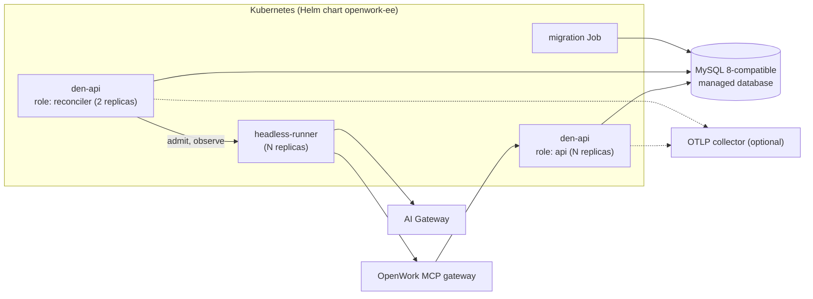

# Operations: monitoring, deployment, runbooks

Status: proposal. Part of [the orchestrator plan](README.md). Covers brief steps 9
and 12 and the runbook and deployment artefacts. Every threshold and target here
is a starting proposal to confirm; the ones that need a decision are marked.

## 1. Observability

The brief asks that agent health, status, output, errors and resource usage are
observable. Each has a durable source in the database, so the product works with
no external metrics system, and an optional export for deployments that have one.

| Observable | Source of truth | Shown in |
| --- | --- | --- |
| Health | Newest attempt heartbeat and runner presence, recent failure rate | Agent row and detail |
| Status | `state` and `desiredState` of agents; `state` of tasks | Agents list, task list |
| Output | Task `result`, `task.complete` messages, artifacts | Task timeline |
| Errors | Attempt `error` with class and code; dead letters | Task timeline, Needs you |
| Resource usage | Attempt `usage` (tokens, cost, duration); budget counters | Agent detail, overview |

### Rollups

The reconciler maintains `orchestrator_rollup`: per agent, per minute and per
hour, counts of tasks by outcome, attempts by error class, retries, latency
histogram buckets, tokens, spend, queue depth samples and heartbeat age. The UI
charts, the overview endpoint and the alert rules read rollups, so none of them
depend on `DEN_OBSERVABILITY_BACKEND`. Rollup writes are idempotent per bucket.

### Metrics

Emitted through the existing OpenTelemetry path when
`DEN_OBSERVABILITY_BACKEND=otel` (`ee/apps/den-api/README.md`). With `none`, the
same facts are in the logs and rollups.

| Metric | Type | Labels |
| --- | --- | --- |
| `orchestrator_tasks_total` | counter | `agent`, `type`, `state` |
| `orchestrator_queue_depth` | gauge | `agent`, `priority` |
| `orchestrator_queue_oldest_age_seconds` | gauge | `agent` |
| `orchestrator_task_wait_seconds`, `_run_seconds`, `_end_to_end_seconds` | histogram | `agent`, `type` |
| `orchestrator_attempts_total` | counter | `agent`, `outcome`, `error_class` |
| `orchestrator_agent_heartbeat_age_seconds` | gauge | `agent` |
| `orchestrator_agent_state` | gauge | `agent`, `state` |
| `orchestrator_tokens_total` | counter | `agent`, `direction` |
| `orchestrator_cost_micro_usd_total` | counter | `agent` |
| `orchestrator_budget_used_ratio` | gauge | `agent`, `period` |
| `orchestrator_approvals_pending`, `orchestrator_approval_age_seconds` | gauge | `agent` |
| `orchestrator_loop_guard_trips_total` | counter | `guard` |
| `orchestrator_dead_letters_total` | counter | `agent`, `reason` |
| `orchestrator_effects_total` | counter | `agent`, `tier`, `outcome` |
| `orchestrator_ledger_head_sequence`, `_verify_failures_total` | gauge, counter | none |
| `orchestrator_reconciler_cycle_seconds` | histogram | `step` |
| `orchestrator_a2a_requests_total` | counter | `operation`, `outcome` |

Labels use agent slugs, never task ids, to keep cardinality bounded.

### Logs

Structured JSON through `appLogger` with `component: "orchestrator"` and, where
they apply, `agent_id`, `task_id`, `attempt_id`, `correlation_id` and `trace_id`.
Logs hold ids, digests, states and error codes. They never hold instructions,
payloads, arguments, message bodies, memory values or tokens; a test asserts it.
`Authorization`, cookie, body and query redaction already applies to request
logs.

### Traces

One trace per process. The root task stores a W3C `traceparent`; every task,
attempt, model call, tool call and approval wait is a span in it, so a process
that crosses six agents and a person is one picture. With the `none` backend the
trace id is still stored and logged, so logs can be joined by hand.

### Dashboards

- **In the app** ([ui.md](ui.md)): the agents list, agent detail charts for
  throughput, latency (p50, p95), failures by class and spend, and the overview
  counts.
- **Den dashboard monitor**: a read-only mirror, as "My Automations" is, linking
  back to the app for management.
- **Self-hosted Grafana**: a dashboard JSON over the metrics above, delivered in
  milestone M6 under `infra/`.

## 2. Alerts

Severities: **sev1** a control or integrity failure (act now); **sev2** the
service or an agent is down or misbehaving with business impact; **sev3**
degraded or at risk; **sev4** information. Default routes are the in-app
notification centre to owners and super-admins, plus a webhook for the operator's
paging system. Channels beyond those are a decision (see
[delivery-plan.md](delivery-plan.md)).

| Id | Condition | Sev | Automatic action |
| --- | --- | --- | --- |
| AL1 Agent unavailable | Desired `running` and no heartbeat for 3 leases (3 min) | 2 | Restart up to 3 times an hour, then quarantine |
| AL2 Task stalled | `running` with no progress for 2 leases, or `queued` longer than the agent's queue age limit (default 15 min) | 3 | Mark attention item |
| AL3 Repeated failures | 3 consecutive failures, or more than 30% errors over 15 minutes with at least 10 attempts | 2 | Circuit breaker may quarantine |
| AL4 Dead letters | Any new dead letter; 10 or more in an hour | 3; 2 | Attention item |
| AL5 Budget | 80% of any limit; 100% | 4; 2 | At 100% the agent is quarantined `budget_exhausted` |
| AL6 Approval ageing | Pending for half its expiry; expired unanswered | 3 | Escalation rule runs |
| AL7 Loop guard | Any trip | 2 | The guard's own action |
| AL8 Config change | An agent with external-write tools is activated or its owner changes | 4 | Notify owners |
| AL9 Ledger integrity | Daily chain verification fails | 1 | Engage the kill switch for the organization pending review |
| AL10 Runner fleet | No runner capacity for 5 minutes; more than 5 runner restarts in 10 minutes | 2 | None |
| AL11 Queue backlog | Depth growing for 10 minutes while workers are free | 3 | None |
| AL12 Connection needs sign-in | An agent is blocked by an expired credential | 3 | Attention item with a reconnect action |
| AL13 Metering drift | Orchestrator totals differ from gateway usage by more than 5% in a day | 3 | None |

## 3. Service targets (proposed, need confirmation)

| Target | Proposal | Why it is only a proposal |
| --- | --- | --- |
| Control-plane API availability | 99.9% monthly | The brief gives no target |
| Acknowledged task durability | No loss: a task is acknowledged only after commit. Recovery point equals the database's: zero for synchronous multi-zone failover, minutes for restore from point-in-time backup | Depends on the managed database tier |
| Stalled-work detection | Within 2 leases (2 minutes) | |
| Restart after worker loss | One reconciler cycle plus a lease (about 75 seconds) | |
| Reconciler recovery time | 5 minutes | |
| Queue wait | p95 under 30 seconds for priority 5 or higher at nominal load | Needs the load test |
| Approval visibility | Under 10 seconds from request to the approver's screen | |

**Scale assumptions.** Pilot: at most 10 agents, 5 concurrent attempts per
organization, 1,000 tasks a day. Design target for v1: 100 agents per
organization, 50 concurrent attempts, 100,000 tasks a day per cluster, at most
50 claims a second. Milestone M7's load test confirms or corrects these.

## 4. Deployment

### Profiles

The brief leaves the environment open: Azure, on-premises or hybrid. The plan
builds on what exists and supports all of them. **The pilot uses the first row,
chosen because the team has full control of it and it runs on one local device
with nothing outside the machine required** (decision D13).

| Profile | What runs where | Basis |
| --- | --- | --- |
| Local single node (pilot) | Den API with the reconciler, Den web, MySQL and one headless runner on one machine the team controls, started with Docker Compose | `packaging/docker/docker-compose.eval.yml`, `packaging/docker/den-dev-up.sh`, `packages/docs/self-host/evaluate-with-docker-compose.mdx` |
| Hosted | Den and runners operated by OpenWork | Existing hosted Den |
| Self-hosted | Den, reconciler, MySQL and runners in the customer's Kubernetes cluster | `packaging/helm/openwork-ee`; guides `docs/aws-eks-helm.md`, `docs/azure-aks-helm.md`, `docs/gcp-gke-helm.md` (managed MySQL 8-compatible database in each) |
| Hybrid | Den hosted or self-hosted; `headless` runners inside the customer network pulling work over outbound HTTPS | Pull model of `docs/features/automations-desktop-runner/README.md`; needs the runner protocol in [api.md](api.md) |

### Local single-device profile (the pilot)

Why this one: the team owns the machine, the database and every secret, so
nothing is out of reach when something needs inspecting. Nothing outside the
machine is required to run it: the Den stack uses `PROVISIONER_MODE=stub`, so no
cloud workers are created; the headless runner is the only runner; no inbound
port is opened; and the code paths are the same ones production uses.

| Component | Source | Notes |
| --- | --- | --- |
| MySQL 8.4 | The Compose stacks in `packaging/docker/` | One Docker volume. This volume **is** the queue, the configs and the ledger |
| Den API, `role: all` | `Dockerfile.den`; published image in the evaluation stack | Runs the API and the reconciler together |
| Den web | `Dockerfile.den-web` | `http://localhost:3005`; approvals and the Orchestrator tab are reached here, or from the desktop or web app by setting the on-premises server URL on its sign-in screen |
| Headless runner | `ee/apps/headless-runner`, started as a Node process or a container | One instance; SQLite file on a persistent path (`HEADLESS_DB_PATH`); private, reached only by Den. **Not packaged yet**: a Dockerfile and a Compose overlay are an M6 deliverable |
| Model access | One of the options below | Needed by the runner |
| Connections for the sample | Small mock MCP servers for inbox, knowledge base and mail | The sample uses mocks; `mcpMock()` in `evals/packages/env/src/mock.ts` is the template. The existing Enterprise MCP Mock Lab models ticketing and Microsoft surfaces, not an inbox |

**Model access.** The runner speaks the Anthropic Messages or OpenAI Chat
Completions protocol to `HEADLESS_MODEL_BASE_URL`. For one machine:

1. *OpenWork Gateway container* (`Dockerfile.gateway`): gives metering and the
   usage limits the plan relies on.
2. *A provider key in `HEADLESS_MODEL_API_KEY`*, the runner's single-tenant
   fallback: simplest. Spend is estimated, not metered (decision D8).
3. *A local OpenAI-compatible model server*: keeps everything on the device, but
   tool-calling quality varies by model and this has not been tried.

**Wiring.** Den already reads `DEN_HEADLESS_RUNNER_URL` and
`DEN_HEADLESS_RUNNER_TOKEN` for the Slack assistant's headless runtime; the
orchestrator reuses them, with the token equal to the runner's
`HEADLESS_API_TOKEN` (32 characters or more). The runner's `HEADLESS_MCP_URL`
points at the local Den `/mcp/agent`; the runner permits plain HTTP on loopback.

**Harden it before the pilot.** The evaluation stack is not production-safe by
default: it enables public signup and uses development credentials.

- Generate real values for `OPENWORK_AUTH_SECRET` and `OPENWORK_DB_ENCRYPTION_KEY`.
- Set `OPENWORK_ALLOW_SIGNUP=false` and use the private first-administrator
  flow (`OPENWORK_OWNER_EMAILS`, `OPENWORK_SETUP_CODE`).
- Keep every port bound to loopback. For a second device, use an SSH tunnel or a
  private network, as the evaluation guide describes.
- Keep `.env` private (`umask 077`) and out of version control.
- Keep the A2A endpoint on loopback too. It needs TLS before any other device can reach
  it, so use a TLS tunnel rather than opening the port.

**What a single device cannot give you.**

| Limit | Consequence and handling |
| --- | --- |
| Availability equals the device | A sleeping laptop is an outage. Use an always-on machine, or disable sleep for the pilot. Expired leases and missed ticks recover as designed when it returns, but nothing runs while it is off |
| One disk | Back up MySQL (see below) and the runner's SQLite file; losing the volume loses the queue and the ledger |
| No public address | Webhook event sources cannot reach it. The sample's intake agent polls instead; a tunnel (for example Tailscale, which `den-dev-up.sh` already detects) can be added later |
| Resource limits | The runner and Den share the machine. Keep pilot scale (about 10 agents, 5 concurrent attempts) and watch memory |
| Service targets | The targets in section 3 describe the hosted and Kubernetes profiles; the local profile only promises recovery, not uptime |

### Topology

Run the reconciler as its own deployment in production (`role: reconciler`). Any
number of replicas is safe, because every step is a conditional update. Two is
for availability, not correctness. For small installs, `role: all` runs it
inside `den-api`.

### Configuration

Names are proposals, modelled on `DEN_AUTOMATIONS_*` in `ee/apps/den-api/src/env.ts`.

| Variable | Default | Purpose |
| --- | --- | --- |
| `DEN_ORCHESTRATOR_ENABLED` | `false` | Routes and product surface |
| `DEN_ORCHESTRATOR_ROLE` | `all` | `api`, `reconciler` or `all` |
| `DEN_ORCHESTRATOR_POLL_INTERVAL_MS` | `15000` | Reconciler cycle |
| `DEN_ORCHESTRATOR_BATCH_SIZE` | `25` | Claims per cycle per agent |
| `DEN_ORCHESTRATOR_LEASE_MS` | `60000` | Attempt lease |
| `DEN_ORCHESTRATOR_HEARTBEAT_MS` | `20000` | Heartbeat period |
| `DEN_ORCHESTRATOR_DRAIN_TIMEOUT_MS` | `30000` | Graceful shutdown window |
| `DEN_ORCHESTRATOR_LEDGER_ANCHOR_URL` | none | Optional write-once store for daily anchors |

The runner address and token are not new variables: the orchestrator reuses
`DEN_HEADLESS_RUNNER_URL` and `DEN_HEADLESS_RUNNER_TOKEN`, the ones Den already
uses for the Slack assistant's headless runtime. Add matching values under the
existing chart, and a `headlessRunner` section if the chart does not already
deploy it.

### Database

MySQL 8-compatible, as for the rest of Den; MariaDB compatibility is kept (no
`SKIP LOCKED`, no features the existing `compatJsonColumn` path avoids).
Migrations are generated only from `ee/packages/den-db` with
`pnpm --dir ee/packages/den-db db:generate`, and use expand-then-contract so old
and new replicas can run together during a rollout. Do not give a runner database
credentials; runners never talk to MySQL.

### Network

Runners may reach only the AI Gateway and the OpenWork MCP gateway, the way the
headless runner already restricts itself to operator-configured URLs. Den never
exposes the runner. In hybrid mode no inbound port is opened in the customer
network.

### Upgrades

Run the migration Job first. Deploy `den-api` replicas, then the reconciler. A
reconciler on an older schema version refuses to claim rather than guess. To
upgrade the runner, pause agents of that target, wait for attempts to drain, roll
the runner, resume.

### Backup and restore

Use the managed database's point-in-time recovery. On the local profile, take a
nightly `mysqldump` of the Den database and copy it, and the runner's SQLite
file, off the device. A restore needs care, because the database may be older
than the world:

1. Engage the kill switch before restoring.
2. Restore, then verify the ledger chain.
3. Every lease has expired by then. Effects left in `intent` or `executing` become
   `unknown` and are never retried automatically after a restore.
4. Review `unknown` effects (RB10), then resume agents one at a time.

## 5. Runbooks

Each assumes the person has `orchestrator.operate`; items marked admin need
`orchestrator.admin`.

### RB1 Agent unavailable or will not start

*Symptom.* AL1 fired, or the row says "Not responding" or stays "Starting".
*Check.* Agent detail, "Now" row: last heartbeat. Overview: runner capacity (AL10).
Ledger: was a version just activated? *Do.* If the runner fleet is down, see RB9
for the fleet. If a new version was just activated, roll back from the version
history. Otherwise Restart. *Escalate.* If it quarantines again within an hour,
leave it paused and open an incident (sev2).

### RB2 Queue growing or tasks stalled

*Symptom.* AL2 or AL11. *Check.* Tasks list filtered by agent and state: are tasks
`queued` with free workers (a routing or claim problem), `running` without
progress (a stuck model or tool), or `waiting_*` (a person)? *Do.* Queued with
free workers: check `not_before` and `unroutable`; confirm an active agent
accepts the type. Stuck running: cancel the task, which cancels the live
attempt; it retries by policy. Waiting on people: see RB6. *Escalate.* If depth
keeps growing with idle workers, treat as a reconciler fault (RB9).

### RB3 Dead letters

*Symptom.* AL4. *Check.* Open each item: reason (`max_attempts`, poison, loop
guard, budget) and every attempt's error. *Do.* Transient cause fixed: Requeue.
Bad payload: edit and requeue (a new superseding task). Wrong agent: Reassign.
Unrecoverable: Discard with a reason. *Escalate.* Many with the same reason means
a systemic fault; pause the agent first, then investigate.

### RB4 Spend alert or budget exhausted

*Symptom.* AL5 or AL13. *Check.* Agent detail, Spend: which period and which
tasks. *Do.* If legitimate, raise the limit in a new version, with a change note.
If not, leave the agent paused, find the task or loop responsible in the
timeline, and cancel it. Drift (AL13): compare against gateway usage for BYOK
estimation gaps. *Escalate.* Unexplained spend is a sev2.

### RB5 Loop guard tripped

*Symptom.* AL7. *Check.* Task timeline: the path and which guard. *Do.* Do not
raise the cap to make it pass. Fix the instructions or delegation targets in a
new version, then requeue the dead letter. *Escalate.* A trip on an agent with
external-write tools is reviewed the same day.

### RB6 Approvals waiting or expiring

*Symptom.* AL6. *Check.* Needs you, oldest first. *Do.* Approve or decline each
with a comment. If approvers are unavailable, add a member to the agent's
approvers in a new version rather than asking someone to approve blind.
*Escalate.* If approvals expire regularly, the escalation rules or approver list
are wrong.

### RB7 Connection needs sign-in

*Symptom.* AL12. *Do.* Reconnect the named connection (the same flow as elsewhere
in the app); blocked tasks resume. Do not retry in a loop. *Escalate.* If the
connection keeps expiring, fix its owner or scopes.

### RB8 Ledger verification failed (sev1)

*Symptom.* AL9. *Do.* The kill switch is already engaged. Do not edit data. Export
the ledger and the database audit trail, compare with the last good anchor,
identify the first broken sequence number, and preserve backups. *Escalate.*
Treat as a security incident; do not resume until the cause is known.

### RB9 Reconciler or runner fleet down

*Symptom.* AL10, no agent heartbeats, nothing dispatched. *Check.* Reconciler
deployment health and logs for cycle errors; database reachability; runner health
endpoint. *Do.* Restart the failing deployment. Tasks and leases are in the
database, so nothing is lost; expired leases are reaped on the next cycle.
*Escalate.* If the database is the cause, follow the Den incident runbook in
`docs/den-api-deployment-incident-runbook.md`.

### RB10 Unknown effect outcome

*Symptom.* A task is waiting on an effect marked `unknown` after a crash or a
restore. This only reaches a person when the capability has no registered
verifier and is not idempotent. *Do.* Check the external system for the action
(for the sender, search the sent mail). If it happened, mark it done with a note;
if not, mark it for retry. Either choice is a ledger entry. Never mark retry
without checking. Afterwards, register a verifier for that capability so the next
one settles itself. *Escalate.* If it cannot be verified, decline the task and
tell its owner.

### Emergency stop

Pause all agents (admin). It stops new claims at once and cancels live attempts
within 20 seconds. Use it when an agent may be doing something wrong and you
cannot find which. Resume all restores exactly the agents it paused. Both are
ledger entries.

## 6. Incident procedure

1. **Detect.** An alert, a report, or a person noticing. Open an incident
   record with severity and the first-seen time.
2. **Contain.** Pause the agent, or all agents. Containment comes before
   diagnosis; pausing is cheap and reversible.
3. **Assess.** Use the task timeline and the ledger to establish what ran, with
   which version, with whose approval, and what changed outside the system.
4. **Recover.** Roll back the version, fix the cause, requeue or discard work,
   resume one agent at a time while watching its first attempts.
5. **Communicate.** Tell the agent owners and approvers what happened and what
   was affected, including any external effect that ran.
6. **Review.** A written review within five working days: timeline, cause, what
   the guards did or missed, and changes to limits, validation or this plan.
   Findings that need a control become new rules or tests, not reminders.

Roles for a sev1 or sev2: an incident lead who decides, an operator who acts, and
someone who communicates. One person may hold more than one in a small team.
